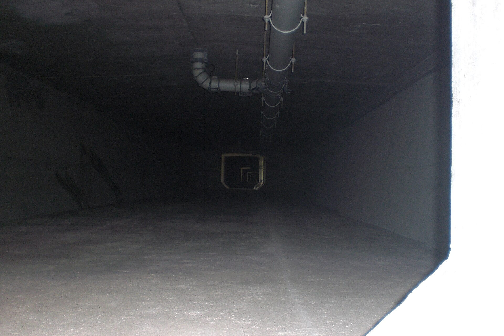
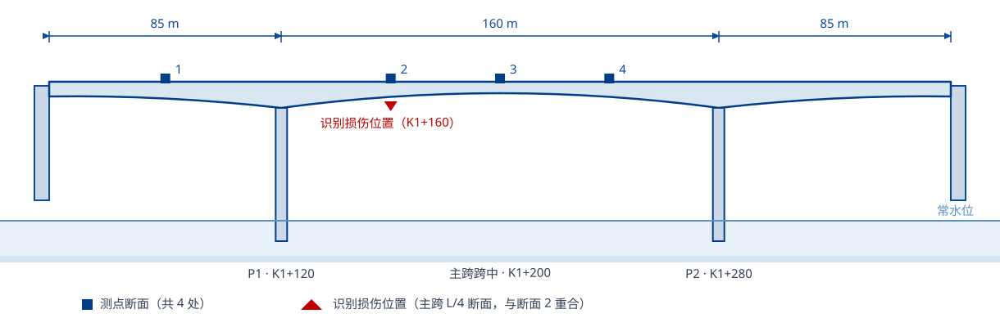
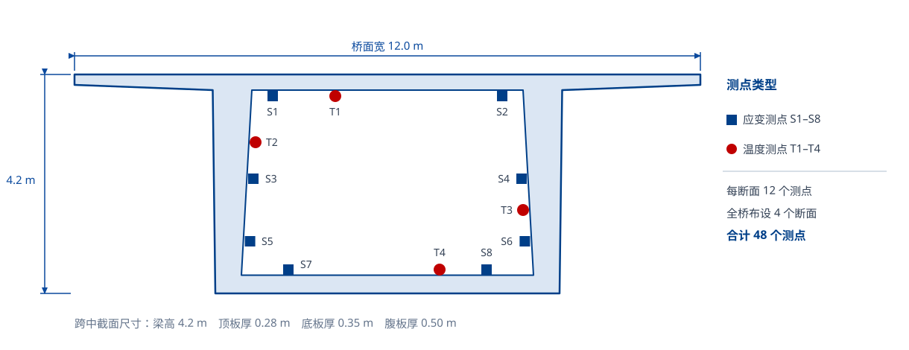
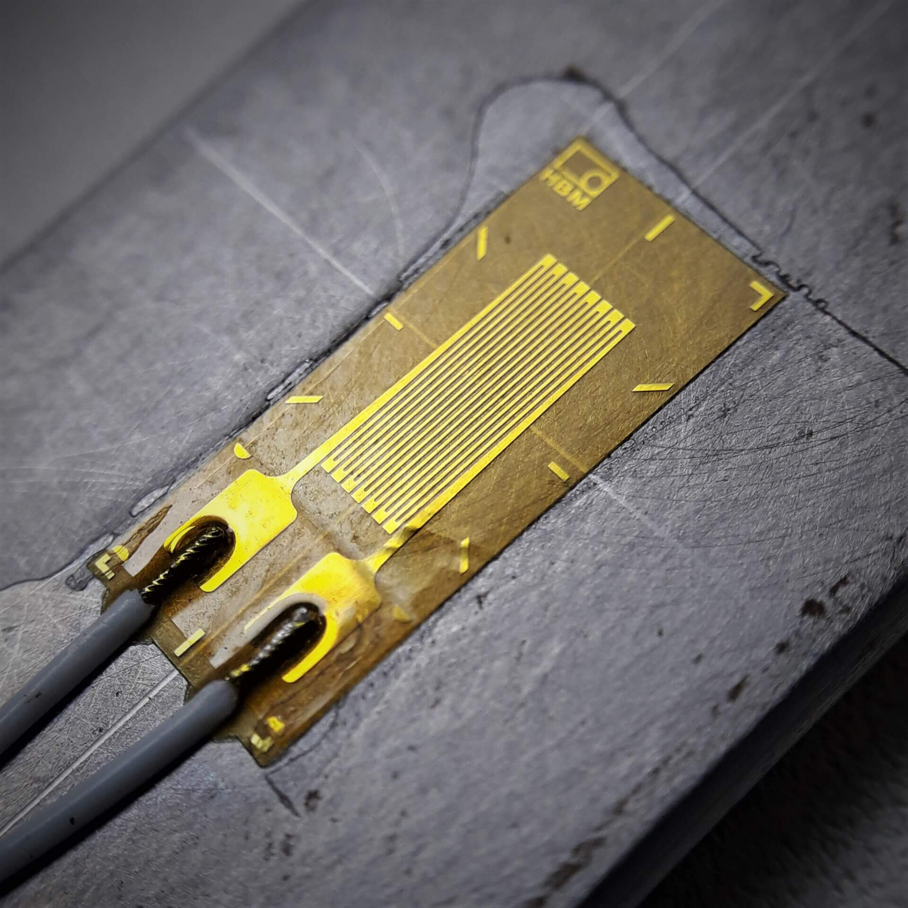
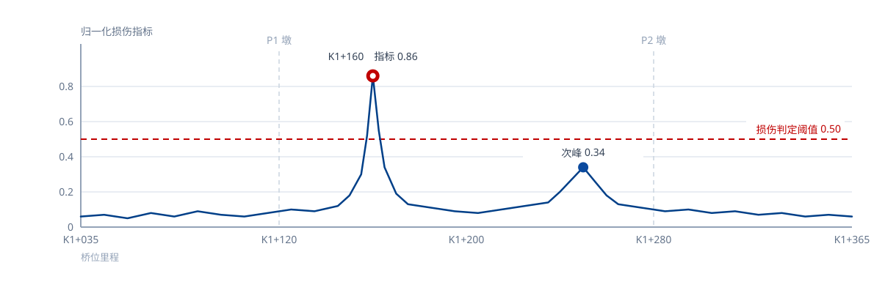

<!--
_class: homePageCUST
-->

# 研究生工作月报

## 依托工程现场工作与桥梁损伤识别科研进展

<flex center>

<iconitem icon="话筒">汇报人：×××</iconitem>

<iconitem icon="人员">指导教师：××× 教授</iconitem>

</flex>

---

<!--
_class: contents
-->

## 目录

- **01** 本月工作概览
- **02** 现场工作
- **03** 科研工作进展
- **04** 问题与困难
- **05** 下月工作计划

---

<!--
_class: chapterPage
-->

01

## 本月工作概览

### 现场驻场 11 天 · 精读文献 12 篇 · 基准模型修正完成

---

<!--
_header: 本月工作概览
_class: contentPage
-->

<grid cols="4">

<metric>

#### 11 天

现场驻场

<tag>9/2 — 9/16</tag>

</metric>

<metric green>

#### 12 篇

文献精读

<tag>含 SCI 一区 4 篇</tag>

</metric>

<metric yellow>

#### 48 个

传感器测点

<tag>存活率 92%</tag>

</metric>

<metric red>

#### 2.4%

模型频率误差

<tag>修正后</tag>

</metric>

</grid>

<tag>本月主线</tag> 打通「现场实测数据 → 基准模型修正 → 损伤识别」的完整链路

<flex>

<card green>

### 现场工作

- 主桥与引桥外观普查，建立病害台账
- 4 个测试断面 48 个测点布设与调试
- 采集系统 48 h 不间断试运行

</card>

<card yellow>

### 科研工作

- 三条损伤识别技术路线梳理与选型
- 全桥梁-实体混合模型建成并完成修正
- 三组跑车工况实测数据入库

</card>

</flex>

---

<!--
_class: chapterPage
-->

02

## 现场工作

### 依托工程 · 外观检测 · 传感器布设

---

<!--
_header: 现场工作 — 依托工程概况
_class: contentPage
-->

依托工程为湖南某高速公路跨河特大桥，2013 年 11 月建成通车，至今服役 13 年。主桥采用三跨预应力混凝土连续刚构，主跨跨越通航河道。本月现场工作即围绕该桥展开。

<datatable>

### 依托工程主要技术参数

| 项目 | 参数 |
|------|------|
| 桥型 | 预应力混凝土连续刚构 |
| 跨径布置 | 85 m + 160 m + 85 m |
| 主梁形式 | 单箱单室箱梁，墩顶梁高 9.5 m，跨中梁高 4.2 m |
| 桥面宽度 | 12.0 m（双向四车道） |
| 设计荷载 | 公路-Ⅰ级 |
| 通车时间 | 2013 年 11 月（服役 13 年） |

</datatable>

<tag>依托背景</tag> 该桥已进入服役中期，跨中下挠与腹板开裂是同类桥型的典型病害，需建立长期监测手段

---

<!--
_header: 现场工作 — 依托工程实景
_class: contentPage
-->

<grid cols="2">

<figure compact>

依托工程桥梁实景（跨河混凝土梁桥）

</figure>

<figure compact>

箱梁内部作业环境：照明与通风条件受限

</figure>

</grid>

<note footnote>本页照片为同类工程的公开示意图，非本项目现场照片。来源：Asopotnik、Larusso / Wikimedia Commons（CC BY-SA 3.0 / 4.0）</note>

---

<!--
_header: 现场工作 — 测点断面布置
_class: contentPage
-->

<figure>

主桥立面布置（85 m + 160 m + 85 m）与 4 个测试断面位置

</figure>

<note footnote>断面 1～4 分别位于边跨跨中、主跨 L/4、主跨跨中与主跨 3L/4；外观检测发现的腹板斜裂缝集中在断面 2 附近。</note>

---

<!--
_header: 现场工作 — 本月现场安排
_class: contentPage
-->

<timeline compact>

- 9 月 2 日 — 9 月 5 日：桥面系与上部结构外观检测

  > 4 天

  - 会同检测单位完成主桥 3 跨、引桥 12 孔的裂缝普查
  - 建立病害台账，累计记录裂缝 216 条

- 9 月 8 日 — 9 月 12 日：主跨测试断面传感器布设

  > 5 天

  - 布设应变测点 32 个、温度测点 16 个，合计 48 个
  - 完成箱内线缆敷设与采集仪安装调试

- 9 月 15 日 — 9 月 16 日：设备联调与现场协调

  > 2 天

  - 与业主、监理、养护单位确认线缆走线与取电方案
  - 采集系统完成 48 h 不间断试运行

</timeline>

<tag>本月现场</tag> 累计驻场 11 天，完成从外观普查到监测系统布设的全过程

---

<!--
_header: 现场工作 — 外观检测结果
_class: contentPage
-->

<grid cols="3">

<card green>

### 主体结构

箱梁腹板、底板未见结构性裂缝，墩身混凝土外观完好，未见明显露筋与剥落。

</card>

<card yellow>

### 桥面系

桥面铺装局部网状裂缝 3 处，累计约 42 m²；2 道伸缩缝存在杂物堵塞。

</card>

<card red>

### 重点关注

主跨 L/4 附近腹板斜裂缝 6 条，最大宽度 0.18 mm，超出 0.15 mm 限值。

</card>

</grid>

<datatable>

### 病害台账统计

| 部位 | 病害类型 | 数量 | 最大宽度 | 评价 |
|------|---------|------|---------|------|
| 箱梁腹板 | 斜裂缝 | 6 条 | 0.18 mm | 超限 |
| 箱梁底板 | 纵向裂缝 | 11 条 | 0.12 mm | 满足 |
| 桥面铺装 | 网状裂缝 | 3 处 | — | 需修补 |
| 伸缩缝 | 杂物堵塞 | 2 道 | — | 需清理 |

</datatable>

<note red>腹板斜裂缝已超出规范限值，检测结果已同步反馈至养护单位，建议纳入专项观测。</note>

---

<!--
_header: 现场工作 — 传感器布设方案
_class: contentPage
-->

<figure>

测试断面测点布置（每断面 8 个应变测点 + 4 个温度测点）

</figure>

---

<!--
_header: 现场工作 — 测点安装实录
_class: contentPage
-->

<flex>

<card>

<figure auto>

应变计粘贴于箱梁内壁并接入引线

</figure>

</card>

<card>

<figure auto>

荷载试验加载车辆（2 辆 30 t 三轴载重车）

</figure>

</card>

</flex>

<note footnote>本页照片为同类工程的公开示意图，非本项目现场照片。来源：Cristian V.、Destroducks / Wikimedia Commons（CC BY 4.0 / CC BY-SA 4.0）</note>

---

<!--
_class: chapterPage
-->

03

## 科研工作进展

### 文献调研 · 模型修正 · 车致响应实测 · 损伤识别

---

<!--
_header: 科研工作 — 本月总览
_class: contentPage
-->

<grid cols="3">

<feature>

#### 有限元建模

建立全桥梁-实体混合模型，完成模态与静力校核

<tag>已完成</tag>

</feature>

<feature green>

#### 模型修正

以实测模态为目标反演结构参数，频率误差降至 2.4%

<tag>已完成</tag>

</feature>

<feature yellow>

#### 损伤识别

基于小波包能量曲率差构造指标，完成首次识别

<tag>进行中</tag>

</feature>

</grid>

<tag>本月主线</tag> 由「把模型建准」推进到「用模型判断损伤」，识别结果与现场病害位置一致

<grid cols="2">

<card>

### 数据基础

- 三组跑车工况，有效响应样本 18 组
- 四个断面 48 个测点同步采集
- 采样频率 100 Hz，单工况连续 10 min

</card>

<card>

### 待完善环节

- 温度效应尚未从实测应变中分离
- 损伤指标阈值缺乏统计样本支撑
- 数值模拟损伤工况待补充

</card>

</grid>

---

<!--
_header: 科研工作 — 文献调研与路线选型
_class: contentPage
-->

围绕「在役连续刚构桥损伤识别」，本月精读文献 12 篇，梳理出三条主流技术路线。

<tree>

- 在役连续刚构桥损伤识别
  - **动力指纹法** —— 对整体刚度退化敏感；测点稀疏时空间分辨率不足
    - 模态频率
    - 振型
    - 模态曲率
  - **模型修正法** —— 物理意义明确；目标函数非凸，边界与材料参数不确定性大
    - 结构参数反演
    - 边界条件识别
    - 材料参数识别
  - **数据驱动法** —— 无需力学模型；依赖大量样本，泛化受样本覆盖限制
    - 神经网络
    - 支持向量机

</tree>

<tag>技术选型</tag> 采用「模型修正 + 小波包能量曲率差」的混合路线，兼顾物理可解释性与局部损伤敏感性

---

<!--
_header: 科研工作 — 基准有限元模型修正
_class: contentPage
-->

<compare>

<before badge="修正前">

### 初始有限元模型

按设计图纸建立，未考虑材料退化与边界条件偏差：

- 一阶竖弯频率 **3.46 Hz**
- 与实测值偏差 **8.0%**
- 二期恒载按设计值取用
- 支座边界简化为理想铰接

</before>

<arrow>参数反演</arrow>

<after badge="修正后" green>

### 修正后基准模型

以实测模态为目标，反演弹性模量与支座刚度：

- 一阶竖弯频率 **3.67 Hz**
- 与实测值偏差 **2.4%**
- 实测一阶竖弯频率 3.76 Hz
- 前三阶频率误差均小于 3%

</after>

</compare>

<tag>修正参数</tag> 主梁弹性模量由 3.45×10⁴ MPa 修正为 3.72×10⁴ MPa，支座转动刚度取设计值的 1.6 倍

---

<!--
_header: 科研工作 — 车致响应实测
_class: contentPage
-->

<flow>

- 布设采集系统

  - 48 通道应变采集仪

- 组织跑车加载

  - 2 辆 30 t 三轴载重车

- 分级加载工况

  - 20 / 40 / 60 km/h

- 同步采集数据

  - 每工况采集 10 min

</flow>

<datatable>

### 跑车试验工况与数据量

| 工况 | 车速 | 车辆总重 | 采样频率 | 重复次数 | 有效样本 |
|------|------|---------|---------|---------|---------|
| 1 | 20 km/h | 60 t | 100 Hz | 6 | 6 组 |
| 2 | 40 km/h | 60 t | 100 Hz | 6 | 6 组 |
| 3 | 60 km/h | 60 t | 100 Hz | 6 | 6 组 |

</datatable>

<tag>数据质量</tag> 三个工况共获取有效响应样本 18 组，应变时程曲线重复性满足后续分析要求

---

<!--
_header: 科研工作 — 损伤识别初步结果
_class: contentPage
-->

<figure>

小波包能量曲率差指标沿桥长分布（工况 2，车速 40 km/h）

</figure>

<tag>初步结论</tag> K1+160（主跨 L/4 断面）指标值 0.86 显著超过判定阈值 0.50，与外观检测发现的腹板斜裂缝位置吻合；次峰 0.34 未超阈值，待补充样本进一步验证

---

<!--
_header: 科研工作 — 阶段性成果
_class: contentPage
-->

<grid cols="2">

<card green>

### 论文进展

- 学位论文第 3 章《基于模型修正的基准有限元模型》完成初稿
- 期刊论文选题确定：《基于小波包能量曲率差的在役连续刚构桥损伤识别》
- 目标期刊《振动与冲击》《桥梁建设》

</card>

<card>

### 专利与工具

- 发明专利《一种基于车致响应的桥梁损伤定位方法》已完成技术方案与权利要求书初稿
- 编制数据处理脚本 1 套（Python，约 600 行），实现数据清洗与指标计算自动化

</card>

</grid>

<checklist done>

- ~~文献综述框架与三条技术路线梳理~~
- ~~全桥有限元模型建立与修正~~
- ~~4 个断面传感器布设与调试~~

</checklist>

<tag>下阶段</tag> 补充两组损伤工况的数值模拟样本，为指标阈值标定提供统计依据

---

<!--
_class: chapterPage
-->

04

## 问题与困难

### 现场条件限制与科研瓶颈

---

<!--
_header: 问题与困难 — 现场方面
_class: contentPage
-->

<grid cols="2">

<card red>

### 传感器存活率不足

48 个测点中 4 个数据异常，疑似箱内线缆接头受潮。

- 影响：跨中截面应变测点由 8 个减为 6 个
- 计划：10 月上旬返场更换接头并重新标定

</card>

<card yellow>

### 现场作业条件受限

箱内照明与通风条件差，线缆走线方案与养护单位存在分歧。

- 影响：单日有效作业时间不足 5 h
- 计划：协调养护单位固定走线路径，避开检修通道

</card>

</grid>

<tag red>风险提示</tag> 若 10 月上旬无法完成返场维修，连续监测数据的完整性将受到影响

---

<!--
_header: 问题与困难 — 科研方面
_class: contentPage
-->

<grid cols="3">

<card red>

### 温度效应耦合

实测应变中温度效应占比达 60% 以上，损伤引起的微弱变化被掩盖。

</card>

<card red>

### 模型修正收敛慢

目标函数非凸，优化过程易陷入局部最优，单次修正耗时约 4 h。

</card>

<card red>

### 样本量不足

损伤工况实测样本仅 3 组，指标阈值缺乏统计支撑。

</card>

</grid>

<tag>拟采取措施</tag> 引入温度与应变分离算法、以代理模型加速优化迭代、用数值模拟扩充损伤样本

---

<!--
_class: chapterPage
-->

05

## 下月工作计划

### 10 月 8 日 — 10 月 31 日

---

<!--
_header: 下月计划 — 日程安排
_class: contentPage
-->

<timeline compact>

- 10 月 8 日 — 10 月 12 日：返场维修与数据补采

  > 5 天

  - 更换 4 个异常测点接头，重新标定采集系统
  - 补采 48 h 连续监测数据

- 10 月 13 日 — 10 月 20 日：温度效应分离与数据处理

  > 8 天

  - 建立温度与应变的回归模型，分离温度效应
  - 完成三组跑车工况的数据清洗与指标复算

- 10 月 21 日 — 10 月 31 日：论文撰写与投稿准备

  > 11 天

  - 完成学位论文第 4 章《损伤指标构造与验证》
  - 完成发明专利申请文件定稿

</timeline>

<tag>优先级</tag> 数据补采是第一优先级，后续处理与撰写均以其为前提

---

<!--
_header: 下月计划 — 阶段目标
_class: contentPage
-->

<grid cols="3">

<metric>

#### 48 h

连续监测数据

<tag>实测补采</tag>

</metric>

<metric green>

#### 1 章

学位论文第 4 章

<tag>完成初稿</tag>

</metric>

<metric yellow>

#### 1 篇

期刊论文

<tag>投稿准备</tag>

</metric>

</grid>

<tag>下月主线</tag> 把「数据补全 — 指标标定 — 论文成稿」这条链路走通

<checklist>

- 数据补采与系统复标（10 月 12 日前完成）
- 温度效应分离与指标阈值标定（10 月 20 日前完成）
- 学位论文第 4 章初稿与专利申请文件（10 月 31 日前完成）

</checklist>

---

<!--
_class: thanksPage
-->

# 感谢观看，欢迎交流

## 长沙理工大学土木工程学院 · 2026 年 9 月研究生工作月报
