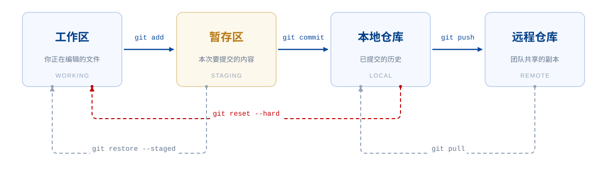
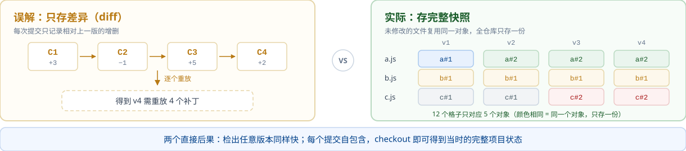
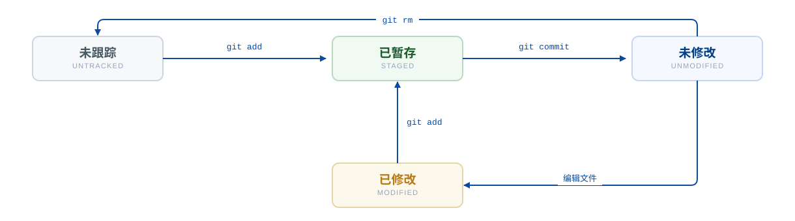
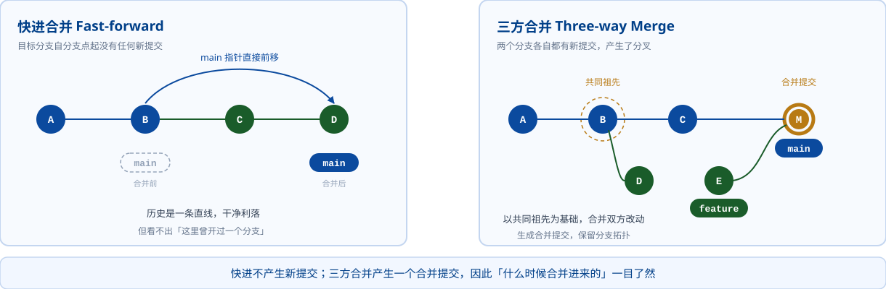
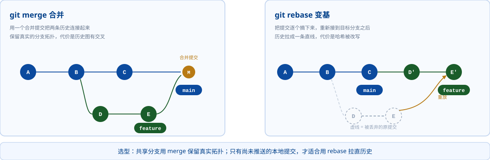
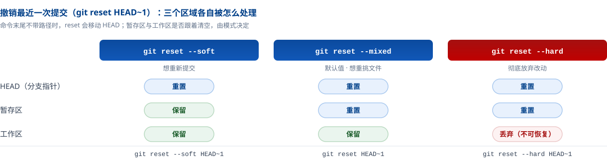

<!--
_paginate: false
_class: homePage
-->

# Git 从入门到精通

## 面向新手的版本控制实战指南

2026 年 9 月

---

<!--
_class: contents
-->

## 目录

- **01** 认识 Git
- **02** 快速上手
- **03** 核心概念
- **04** 分支与合并
- **05** 远程协作
- **06** 撤销与回退
- **07** 进阶与原理
- **08** 团队规范与最佳实践

---

<!--
_class: chapterPage
-->

<div class="chapter-num">01</div>

## 认识 Git

### 从「文件命名灾难」到「可追溯的工程实践」

---

<!--
_header: 认识 Git — 没有版本控制的世界
_class: contentPage
-->

## 没有版本控制的世界

<flex>

<card red>

### 命名灾难

论文_最终版.docx

论文_最终版2.docx

论文_最终版_真的最终版.docx

</card>

<card red>

### 无法回退

昨天能跑的代码今天崩了，却说不清改了什么，只能一行行手动改回去。

</card>

</flex>

<flex>

<card red>

### 协作冲突

三个人各自改一份文件，靠微信互传，最后没人知道哪份是对的。

</card>

<card red>

### 责任不明

线上出 Bug，需要查「这行代码谁改的、为什么改」，无据可查。

</card>

</flex>

<summary bold>

如果你经历过任何一条，那么 Git 正是为你准备的

</summary>

---

<!--
_header: 认识 Git — 什么是版本控制
_class: contentPage
-->

## 什么是版本控制

<flex>

<card>

### 定义

**版本控制系统（VCS）** 是一套记录文件内容变化、并允许你随时取回特定版本的系统。

- 每一次改动都被记录为一次**提交（commit）**
- 每个版本都有唯一标识，可精确回溯
- 支持多人在同一份文件上协作而不互相覆盖

> 本质上，它给项目装上了「时间机器」和「协作枢纽」。

</card>

<card green>

### 它解决的三件事

<checklist>

- 记录：改了什么、谁改的、为什么改
- 回退：任意时刻回到任意历史版本
- 协作：多人并行开发后安全合并

</checklist>

</card>

</flex>

<summary bold>

版本控制不是「备份」，而是对**变更历史**的系统化管理

</summary>

---

<!--
_header: 认识 Git — 集中式 vs 分布式
_class: contentPage
-->

## 集中式 vs 分布式

<compare>

<before>

##### 集中式（SVN / CVS）

- 只有**一台中央服务器**保存全部历史
- 本地只有当前版本，查看历史需联网
- 服务器宕机 → 全员无法提交
- 创建分支代价高，通常懒得开
- 提交即影响他人，风险集中

</before>

<arrow>演进</arrow>

<after>

##### 分布式（Git / Mercurial）

- 每个克隆都是**完整的仓库副本**
- 本地拥有全部历史，离线可查可提交
- 服务器故障可从任意副本恢复
- 分支轻量（一个指针），鼓励多用
- 提交先落本地，推送时才影响他人

</after>

</compare>

<summary bold white>

Git 是分布式的——你的电脑上就有一份完整的历史，而不是一份「缓存的当前版本」

</summary>

---

<!--
_header: 认识 Git — Git 的诞生
_class: contentPage
-->

## Git 的诞生

<timeline>

- 2002 年：Linux 内核使用 BitKeeper 管理代码

  > 背景

- 2005 年：BitKeeper 收回免费授权，社区被迫寻找替代

  > 转折

- 2005 年 4 月：**Linus Torvalds** 用两周写出 Git 初版

  > 诞生

  - 设计目标：快、完全分布式、强力支持非线性开发
  - 数周内便接管了 Linux 内核的版本管理

</timeline>

<summary bold>

Git 是为管理**超大型、高并发、分布式**项目而生，因此它天生适合团队协作

</summary>

---

<!--
_header: 认识 Git — Git 能为你做什么
_class: contentPage
-->

## Git 能为你做什么

<grid cols="4">

<metric>

#### 时间机器

任意版本随时回退

<tag>安全网</tag>

</metric>

<metric green>

#### 并行开发

分支互不干扰

<tag>高效</tag>

</metric>

<metric yellow>

#### 责任追溯

每行代码可归因

<tag>可审计</tag>

</metric>

<metric red>

#### 协作枢纽

多人安全合并

<tag>团队</tag>

</metric>

</grid>

<datatable gray>

### 一个工程师使用 Git 的典型场景

| 场景 | 对应能力 |
|------|----------|
| 尝试新方案怕改坏代码 | 开分支试验，失败就丢弃 |
| 线上出 Bug 要紧急修复 | 从发布标签切修复分支，不影响主线开发 |
| 排查「哪次提交引入了 Bug」 | `git bisect` 二分定位，无需逐个人工排查 |
| 需要交付某个历史版本 | `git tag` 打标签，随时检出 |

</datatable>

---

<!--
_class: chapterPage
-->

<div class="chapter-num">02</div>

## 快速上手

### 安装 · 配置 · 第一个仓库 · 最小工作流

---

<!--
_header: 快速上手 — 安装与首次配置
_class: contentPage
-->

## 安装与首次配置

<flex>

<card>

### 第一步：安装

- **Windows**：官网下载 Git for Windows，自带 Git Bash
- **macOS**：`brew install git` 或安装 Xcode 命令行工具
- **Linux**：`sudo apt install git` / `sudo yum install git`

验证安装：

```bash
git --version
# git version 2.43.0
```

</card>

<card green>

### 第二步：配置身份（必做）

Git 会在每次提交里记录作者信息：

```bash
git config --global user.name "张三"
git config --global user.email "zhangsan@example.com"
```

> 这两条只需执行一次，之后所有仓库都会沿用。

</card>

</flex>

---

<!--
_header: 快速上手 — 推荐全局配置
_class: contentPage
-->

## 一次配好，长期受益

<datatable>

### 值得在第一天就设置的四个配置项

| 配置项 | 作用 | 推荐值 |
|--------|------|--------|
| `core.autocrlf` | 换行符自动转换 | Windows 设 `true`，macOS/Linux 设 `input` |
| `init.defaultBranch` | 新仓库默认分支名 | `main` |
| `core.editor` | 提交信息编辑器 | `vim` / `code --wait` |
| `pull.rebase` | pull 时用合并还是变基 | 新手先用 `false` |

</datatable>

<outline solid>

### 为什么值得花这五分钟

- `autocrlf` 抹平 Windows 与 Linux 的换行符差异，避免整文件「伪改动」
- `defaultBranch` 让新仓库直接使用 `main`，省去每次手动改名
- 团队提前统一 `pull.rebase`，能避免同步策略各自为政

</outline>

---

<!--
_header: 快速上手 — SSH 免密配置
_class: contentPage
-->

## 配置 SSH 密钥

不想每次推送都输入账号密码，就配一把 SSH 钥匙。

<grid cols="2">

<flex column>

### 生成密钥对

```bash
# 1. 生成密钥（一路回车即可）
ssh-keygen -t ed25519 -C "zhangsan@example.com"

# 2. 查看公钥内容
cat ~/.ssh/id_ed25519.pub

# 3. 测试连接
ssh -T git@github.com
```

</flex>

<flex column>

### 添加公钥

把 `cat` 输出的整行内容，粘贴到代码托管平台的设置里：

- GitHub：`Settings → SSH and GPG keys`
- GitLab：`Preferences → SSH Keys`
- Gitee：`设置 → SSH 公钥`

<tag>安全提示</tag> 只上传 `.pub` 公钥，私钥永不外传

</flex>

</grid>

<summary bold>

<tag>名词区别</tag> SSH 密钥是**你的电脑**与**代码平台**之间的凭证，与 Git 提交里记录的作者邮箱是两回事

</summary>

---

<!--
_header: 快速上手 — 创建第一个仓库
_class: contentPage
-->

## 创建第一个仓库

<flex>

<card>

### 方式一：从零开始 `init`

```bash
mkdir my-project && cd my-project
git init
```

在当前目录创建 `.git/` 隐藏目录——**这就是仓库的本体**，删掉它项目就不再是 Git 仓库。

适合：本地已有代码，想开始用 Git 管理。

</card>

<card green>

### 方式二：克隆现有仓库 `clone`

```bash
git clone git@github.com:user/repo.git
```

把远程仓库完整下载到本地，含全部历史与分支。

适合：加入一个已有项目，或把线上代码取到本地。

</card>

</flex>

<outline solid>

### `clone` 到底做了什么

创建一个同名目录 → 下载全部历史和分支 → 自动配置远程地址 `origin` → 自动检出默认分支

</outline>

---

<!--
_header: 快速上手 — 四个区域（核心模型）
_class: contentPage
-->

## 核心模型：四个区域

<figure>



四个区域，以及它们之间的搬运工

</figure>

<summary bold>

暂存区的存在是 Git 与其他 VCS 最大的差异——它让你能**精确挑选**这次要提交什么

</summary>

---

<!--
_header: 快速上手 — 最小工作流
_class: contentPage
-->

## 最小工作流：四步走

<grid cols="2">

<timeline>

- `git status` — 查看当前状态

  > 高频：每次操作前后都敲一下

  - 哪些文件被修改、哪些已暂存、哪些未跟踪
  - 不知道下一步该做什么时就敲它

- `git add <file>` — 把改动放入暂存区

  > 挑选要提交的内容

  - `git add .` 添加当前目录全部改动
  - `git add -p` 逐块挑选，推荐进阶使用

</timeline>

<timeline>

- `git commit -m "说明"` — 生成一个版本

  > 固化为历史

  - 提交信息写「为什么改」，而不是「改了什么」
  - 一次提交只做一件事

- `git push` — 推送到远程

  > 与团队共享

  - 首次推送需指定上游：`git push -u origin main`

</timeline>

</grid>

---

<!--
_header: 快速上手 — 第一次实战
_class: contentPage
-->

## 第一次完整实战

<flex>

<card>

### 从零到一个提交

```bash
git init                     # 1 初始化仓库
echo "hi" > README.md        # 2 新建一个文件
git status                   # 3 查看状态（未跟踪）
git add README.md            # 4 加入暂存区
git commit -m "docs: 初始化"  # 5 生成版本
git log --oneline            # 6 查看历史
```

</card>

<card green>

### 预期输出解读

```text
$ git status
On branch main
No commits yet
Untracked files:
  (use "git add <file>..." to include
   in what will be committed)
        README.md
```

`Untracked files` 表示 Git 发现了这个文件，但还没开始跟踪它——所以第一次必须先 `add`。

</card>

</flex>

---

<!--
_class: chapterPage
-->

<div class="chapter-num">03</div>

## 核心概念

### 快照 · 提交 · HEAD · 引用 · 忽略规则

---

<!--
_header: 核心概念 — commit 的本质
_class: contentPage
-->

## commit 的本质：快照，不是差异

<figure>



</figure>

<flex>

<card>

### 一个 commit 包含什么

- 作者与提交者信息、时间戳
- 提交说明
- 指向本次快照根目录对象（tree）的指针
- 指向父提交的指针（可能 0 个、1 个或多个）

</card>

<card green>

### 提交哈希

`a3f8c2e...` 这个 40 位十六进制字符串，是由提交内容计算出的**内容摘要**。

内容相同 → 哈希相同；内容变了 → 哈希必变。

</card>

</flex>

---

<!--
_header: 核心概念 — HEAD 与引用
_class: contentPage
-->

## HEAD 与引用：Git 的坐标系

<flex>

<card>

### HEAD：你在哪

`HEAD` 是一个特殊指针，指向**你当前所在的分支**（通常）。

```bash
cat .git/HEAD
# ref: refs/heads/main
```

> 切换分支，本质就是修改 HEAD 这一个文件的内容。

</card>

<card green>

### 分支：一个会移动的指针

分支不是什么文件夹副本，只是一个指向某个提交的**可移动标签**。

```bash
cat .git/refs/heads/main
# a3f8c2e9b1c4...（一个 40 位哈希）
```

**创建分支 = 新建一个 40 字节的文件**，因此才能做到瞬间完成。

</card>

</flex>

---

<!--
_header: 核心概念 — 相对坐标
_class: contentPage
-->

## 相对坐标：不写哈希也能定位

<datatable compact>

### 常见的「相对坐标」写法

| 写法 | 含义 |
|------|------|
| `HEAD` | 当前提交 |
| `HEAD~1` | 当前提交的父提交（往回 1 个） |
| `HEAD~3` | 往回 3 个提交 |
| `HEAD^2` | 当前提交的第 2 个父提交（合并提交才有） |
| `main@{yesterday}` | 分支昨天所在的位置 |

</datatable>

<outline solid>

### 为什么日常几乎不用手写哈希

相对坐标让命令直接表达意图——「回退几步」「跟几步前比」：

- `git reset --soft HEAD~1` 撤销最近一次提交
- `git diff HEAD~3 HEAD` 对比三步之内的全部改动
- `git show main@{1}` 查看分支上一次所在的位置

</outline>

---

<!--
_header: 核心概念 — 文件的四种状态
_class: contentPage
-->

## 文件的四种状态

<figure>



四种状态，以及它们之间的转换

</figure>

<summary white bold>

`git status` 就是在告诉你：**每个文件当前处于哪个状态**

</summary>

---

<!--
_header: 核心概念 — .gitignore
_class: contentPage
-->

## .gitignore：什么不该进仓库

<flex>

<card>

### 典型忽略内容

```text
# 依赖与构建产物
node_modules/
dist/
build/

# 环境与密钥
.env
*.key

# 编辑器 / 系统
.vscode/
.DS_Store
```

</card>

<card red>

### 四条必须知道的规则

<checklist>

- **只对未跟踪文件生效**——文件一旦被跟踪，写进 `.gitignore` 也不会停止跟踪
- **已跟踪文件需先移除**——`git rm --cached <file>` 停止跟踪但保留本地文件
- **支持通配与取反**——`*.log` 忽略日志，`!important.log` 单独放行
- **密钥泄露不可逆**——即使事后删除，密钥仍留在历史里，必须立即轮换

</checklist>

</card>

</flex>

---

<!--
_header: 核心概念 — 查看历史
_class: contentPage
-->

## git log：读懂项目历史

<flex>

<card>

### 常用姿势

```bash
# 一行一条，最常用
git log --oneline --graph --all

# 只看某个人的提交
git log --author="张三"

# 查看某个文件的变更历史
git log --follow -- src/main.js

# 搜索提交信息
git log --grep="登录"

# 查看某次提交改了什么
git show a3f8c2e
```

</card>

<card green>

### 一行式输出长什么样

```text
$ git log --oneline --graph
* a3f8c2e (HEAD -> main) feat: 新增
|         用户登录接口
* 7b21d90 fix: 修复分页越界
* 4e5f1a2 docs: 补充接口说明
* c9d0b31 chore: 初始化项目
```

每一个 `*` 是一个提交，越靠上越新。

</card>

</flex>

---

<!--
_class: chapterPage
-->

<div class="chapter-num">04</div>

## 分支与合并

### Git 最强大的能力，也是最容易出错的地方

---

<!--
_header: 分支与合并 — 分支的本质
_class: contentPage
-->

## 分支只是一个指针

<grid cols="2">

<flex column>

### 为什么 Git 的分支这么快

在 SVN 里创建分支要复制整个目录树，所以大家倾向于不开分支。

在 Git 里：

- 分支是一个**指向提交的 40 字节文件**
- 创建分支 = 写一个新文件
- 切换分支 = 改 `HEAD` 指向 + 更新工作区文件

> 因此 Git 鼓励「为一个功能开一个分支」，这在 SVN 时代是不可想象的。

</flex>

<flex column>

### 分支不是文件夹

一个常见误解：以为分支是「把代码复制一份」。

实际上所有分支**共享同一份对象库**，只是指向不同的提交。

```text
        A --- B --- C  ← main
               \
                D --- E  ← feature
```

两个分支的提交 A、B 是同一批对象，没有被复制。

</flex>

</grid>

<summary bold>

正因为分支如此廉价，**「为每个任务开分支」才成为 Git 的标准工作方式**

</summary>

---

<!--
_header: 分支与合并 — 常用命令
_class: contentPage
-->

## 分支常用命令

<flex>

<card>

### 查看与创建

```bash
git branch                    # 查看本地分支（* 为当前）
git branch -a                 # 查看所有分支（含远程）
git branch feature-login      # 创建但不切换
git switch -c feature-login   # 创建并切换（推荐）
git switch -c hotfix a3f8c2e  # 基于某个提交创建
```

</card>

<card green>

### 切换与删除

```bash
git switch main              # 切换到 main
git branch -d feature-login  # 删除已合并分支
git branch -D feature-login  # 强制删除（谨慎）
git branch -m new-name       # 重命名当前分支
```

</card>

</flex>

<summary bold>

<tag>版本提示</tag> Git 2.23 起推荐用 `git switch` 切换分支、`git restore` 撤销修改，它们取代了 `git checkout` 的多重职责

</summary>

---

<!--
_header: 分支与合并 — 合并的两种方式
_class: contentPage
-->

## 合并：快进 vs 三方合并

<figure>



两种合并方式的分支拓扑

</figure>

<summary bold>

同样是合并：快进只是**把指针向前移动**，三方合并则**产生一个新的合并提交**

</summary>

---

<!--
_header: 分支与合并 — 合并操作与冲突
_class: contentPage
-->

## 合并操作与冲突现场

<flex>

<card>

### 标准合并流程

```bash
git switch main              # 1 切到目标分支
git merge feature-login      # 2 合并特性分支
git branch -d feature-login  # 3 清理分支
```

保留合并提交（不做快进）：

```bash
git merge --no-ff feature-login
```

</card>

<card red>

### 冲突发生时

Git 停止合并，在文件里标记冲突区域：

```text
<<<<<<< HEAD
你的改动（当前分支）
=======
别人的改动（被合并分支）
>>>>>>> feature-login
```

`git status` 会列出所有冲突文件。

</card>

</flex>

---

<!--
_header: 分支与合并 — 解决冲突
_class: contentPage
-->

## 解决冲突的标准动作

<timeline compact>

- 打开冲突文件，找到标记，人工决定保留哪部分

  > 第 1 步

- 删除 `<<<<<<<`、`=======`、`>>>>>>>` 三行标记

  > 第 2 步

- `git add <file>` 标记该文件已解决

  > 第 3 步

- `git commit` 完成合并（Git 会预填好合并信息）

  > 第 4 步

- 想放弃重来：`git merge --abort` 回到合并前状态

  > 退路

</timeline>

---

<!--
_header: 分支与合并 — merge vs rebase
_class: contentPage
-->

## merge vs rebase：两种整合方式

<figure>



merge 保留分支拓扑，rebase 把提交重接到目标分支之后

</figure>

<summary white bold>

<tag>黄金法则</tag> **永远不要 rebase 已经推送到公共分支的提交**——别人会基于旧提交工作，历史分叉后难以收拾

</summary>

---

<!--
_header: 分支与合并 — 整理历史
_class: contentPage
-->

## 交互式 rebase：整理杂乱的提交

<flex>

<card>

### 合并多个琐碎提交

开发时随手提交了 5 次「改一下」，推送前应该整理：

```bash
# 交互式编辑最近 3 个提交
git rebase -i HEAD~3
```

编辑器会打开一个待办清单。

</card>

<card green>

### 常用指令

```text
pick   a3f8c2e feat: 新增登录接口
squash 7b21d90 fix: 修复拼写
reword 4e5f1a2 docs: 补充说明
```

- `pick` 保留该提交；`squash` 合并到上一个提交
- `reword` 只改提交信息；`drop` 丢弃该提交

</card>

</flex>

<outline red compact>

### 安全前提

只对**尚未推送**的本地提交做交互式 rebase。如果已经推送，请改用 `git revert`，或确认自己独占该分支后再强推（`--force-with-lease`）。

</outline>

---

<!--
_class: chapterPage
-->

<div class="chapter-num">05</div>

## 远程协作

### remote · fetch / pull / push · PR 工作流

---

<!--
_header: 远程协作 — remote
_class: contentPage
-->

## 远程仓库与 origin

<flex>

<card>

### 什么是 origin

`origin` 只是 `git clone` 时自动给远程仓库起的**默认别名**，没有特殊含义——你完全可以改名。

```bash
# 查看已配置的远程
git remote -v

# 输出示例
origin  git@github.com:user/repo.git (fetch)
origin  git@github.com:user/repo.git (push)
```

</card>

<card green>

### 添加与管理

```bash
# 为本地仓库添加远程（init 的场景）
git remote add origin git@github.com:user/repo.git

# 修改远程地址（如换了协议）
git remote set-url origin git@github.com:user/new.git

# 重命名 / 删除
git remote rename origin upstream
git remote remove origin
```

</card>

</flex>

<summary bold>

<tag>多远程</tag> 可以同时配置多个远程，例如开源项目里 `origin` 指向自己的 Fork，`upstream` 指向原仓库

</summary>

---

<!--
_header: 远程协作 — fetch / pull / push
_class: contentPage
-->

## fetch、pull、push

<grid cols="3">

<metric>

#### fetch

只下载，不合并

<tag>安全</tag>

</metric>

<metric yellow>

#### pull

下载并自动合并

<tag>便捷</tag>

</metric>

<metric green>

#### push

上传本地提交

<tag>共享</tag>

</metric>

</grid>

<datatable>

### 三者对比

| 命令 | 动了什么 | 何时使用 |
|------|----------|----------|
| `git fetch origin` | 只更新本地记录的远程分支，工作区不变 | 想先看看远程有什么变化 |
| `git pull origin main` | fetch + merge，直接改当前分支和工作区 | 日常同步（推荐先 `pull --rebase`） |
| `git push origin main` | 把本地提交上传到远程 | 完成阶段性工作后 |

</datatable>

<summary bold>

<tag>高频困惑</tag> `git pull` = `git fetch` + `git merge`，本地有未提交改动时会直接冲突

</summary>

---

<!--
_header: 远程协作 — 团队协作流程
_class: contentPage
-->

## 典型团队协作流程

<grid cols="2">

<timeline compact>

- 同步最新代码

  > 开始工作前

  - `git switch main && git pull --rebase`

- 拉出功能分支

  > 隔离开发

  - `git switch -c feature/user-profile`

- 本地提交

  > 小步快跑

  - 完成一个小目标就提交一次
  - `git add -p` 逐块挑选，保持原子性

</timeline>

<timeline compact>

- 同步主干改动

  > 避免长期分叉

  - `git fetch origin && git rebase origin/main`

- 推送并开 PR

  > 请求评审

  - `git push -u origin feature/user-profile`
  - 在平台上创建 Pull / Merge Request

- 评审通过后合并

  > 收尾

  - 平台侧合并，删除远程分支
  - `git switch main && git pull` 并清理本地

</timeline>

</grid>

---

<!--
_header: 远程协作 — PR / MR
_class: contentPage
-->

## Pull Request / Merge Request

<flex>

<card>

### PR 是一次「带上下文的请求」

它的价值远超合并代码本身：

- **评审**：同事在具体代码行上讨论
- **追溯**：为什么这么改，讨论记录永久留存
- **CI 门禁**：自动化测试、静态检查在此触发
- **知识传播**：评审者顺带了解改动

</card>

<card green>

### 一个高质量 PR 的特征

<checklist>

- 标题说明「做了什么」，描述说明「为什么」
- 改动控制在 400 行以内，便于评审
- 一个 PR 只解决一个问题
- 关联对应的 Issue / 需求单号
- 作者已自测，CI 全绿
- 截图或复现步骤齐全

</checklist>

</card>

</flex>

<summary bold>

<tag>心态</tag> 提交 PR 是邀请同事一起把代码变好，而不是请求批准

</summary>

---

<!--
_header: 远程协作 — Fork 工作流
_class: contentPage
-->

## Fork 工作流：参与开源项目

<grid cols="2">

<flex column>

### 完整步骤

```bash
# 1. 先在平台上 Fork 原仓库到自己的账号

git clone git@github.com:me/project.git  # 2 克隆 Fork
git remote add upstream \                # 3 加原仓库
  git@github.com:official/project.git
git switch -c fix/typo-in-docs           # 4 拉分支
git push origin fix/typo-in-docs         # 5 推送
# 6. 在平台上向原仓库发起 PR
```

</flex>

<flex column>

### 保持 Fork 同步

原仓库更新后，你的 Fork 不会自动跟进：

```bash
# 拉取原仓库更新
git fetch upstream

# 切到本地 main 并同步
git switch main
git merge upstream/main

# 推回自己的 Fork
git push origin main
```

<tag>提示</tag> 每次开新 PR 前都先同步一次，能显著减少冲突。

</flex>

</grid>

---

<!--
_class: chapterPage
-->

<div class="chapter-num">06</div>

## 撤销与回退

### 把「我搞砸了」变成「小问题」

---

<!--
_header: 撤销与回退 — reset 三种模式
_class: contentPage
-->

## `reset` 的三种模式

<figure>



一张图看懂 `--soft` / `--mixed` / `--hard`

</figure>

<outline red compact>

### `--hard` 前请三思

它会**永久丢弃**工作区和暂存区中未提交的修改。执行前先 `git status` 确认；已提交过的能用 `git reflog` 找回，**从未提交过**的无法找回。

</outline>

---

<!--
_header: 撤销与回退 — revert
_class: contentPage
-->

## `revert`：安全地撤销已推送的提交

<compare>

<before>

##### `git reset`

**删除历史**——把分支指针挪回去，后面的提交从当前分支上消失。

- 会改写已发布的历史
- 适用于：**尚未推送**的本地提交

```bash
git reset --hard HEAD~1
```

</before>

<arrow>VS</arrow>

<after>

##### `git revert`

**新增一个反向提交**——抵消目标提交的改动，历史继续向前。

- 不改写任何已有历史，对协作者完全透明
- 适用于：**已经推送**、别人可能已基于它工作

```bash
git revert a3f8c2e
git revert HEAD
```

</after>

</compare>

<summary white bold>

<tag>判断准则</tag> 提交**是否已经推送到共享分支**——推了就用 `revert`，没推才可以用 `reset`

</summary>

---

<!--
_header: 撤销与回退 — 急救速查
_class: contentPage
-->

## 「我搞砸了」急救速查表

<datatable red>

### 按错误类型对号入座

| 我想…… | 命令 |
|--------|------|
| 撤销工作区某个文件的修改 | `git restore <file>` |
| 撤销已 `add` 但未 `commit` 的文件 | `git restore --staged <file>` |
| 修改最后一次提交的说明 | `git commit --amend` |
| 把漏掉的文件补进上次提交 | `git add <file>` 后 `git commit --amend --no-edit` |
| 撤销已提交但未推送的提交 | `git reset --soft HEAD~1` |
| 撤销已推送的提交 | `git revert <commit>` |
| 提交到了错误的分支 | `git cherry-pick` 摘到正确分支后 reset 原分支 |

</datatable>

<summary bold>

遇到问题先不要慌，也**不要**随手删掉 `.git` 目录重新来——`git status` 和 `git reflog` 几乎能救回一切

</summary>

---

<!--
_header: 撤销与回退 — reflog
_class: contentPage
-->

## reflog：Git 的后悔药

<flex>

<card>

### 什么是 reflog

Git 默默记录了 **HEAD 每一次移动**的历史，包括那些已经「消失」的提交。

```bash
git reflog
```

```text
a3f8c2e HEAD@{0}: reset: moving to HEAD~2
7b21d90 HEAD@{1}: commit: feat: 新增搜索
4e5f1a2 HEAD@{2}: commit: fix: 修复越界
```

</card>

<card green>

### 典型救援场景

```bash
git reflog                     # 先找到目标哈希
git branch recovered 7b21d90   # 误删分支：从哈希恢复
git reset --hard a3f8c2e       # 误 reset：把分支指回去
```

<tag>注意</tag> reflog 只在本地存在，默认保留 90 天，且救不回从未提交过的内容。

</card>

</flex>

---

<!--
_header: 撤销与回退 — stash 与 cherry-pick
_class: contentPage
-->

## 两个实用工具

<flex>

<card>

### `stash`：临时收起手头的活

写到一半，突然要切分支修 Bug，但不想提交半成品：

```bash
git stash          # 收起当前改动
git stash list     # 查看收起列表
git stash pop      # 恢复并删除该记录
git stash apply    # 恢复但保留记录
git stash -u       # 连同未跟踪文件一起收起
```

</card>

<card green>

### `cherry-pick`：定向摘取提交

只想把某个分支上的**某一个提交**拿过来，而不是整个分支：

```bash
# 把指定提交复制到当前分支
git cherry-pick a3f8c2e

# 一次摘多个
git cherry-pick a3f8c2e 7b21d90

# 只取改动不自动提交
git cherry-pick -n a3f8c2e
```

<tag>注意</tag> 会产生一个新的提交（哈希不同），常用于热修复回灌。

</card>

</flex>

---

<!--
_class: chapterPage
-->

<div class="chapter-num">07</div>

## 进阶与原理

### 对象模型 · packfile · tag · bisect · hooks

---

<!--
_header: 进阶与原理 — 对象模型
_class: contentPage
-->

## Git 的四种对象

<datatable>

### 四种对象都存在 `.git/objects/` 目录下

| 对象 | 作用 | 说明 |
|------|------|------|
| **blob** | 文件内容 | 只存内容，不存文件名；内容相同的文件共用一个 blob |
| **tree** | 目录结构 | 记录「文件名 → blob/tree 哈希」的映射；一个 tree 就是一层的目录列表 |
| **commit** | 一次提交 | 指向一个根 tree（当时的完整快照）与父提交，构成历史链；附带作者、时间、提交说明 |
| **tag** | 附注标签 | 指向某个 commit 并附带说明信息；与轻量标签的区别是它本身是一个独立对象 |

</datatable>

<summary bold>

只要理解了「commit → tree → blob」这条引用链，Git 的一切行为都变得可解释

</summary>

---

<!--
_header: 进阶与原理 — 内容寻址
_class: contentPage
-->

## 内容寻址：一切皆哈希

<flex>

<card>

### 哈希是怎么算出来的

```bash
# 亲手算一个 blob 的哈希
echo -n "hello" | git hash-object --stdin
# ce013625030ba8dba906f756967f9e9ca394464a
```

Git 实际计算的是 `"blob " + 长度 + "\0" + 内容` 的 SHA-1。

同样的内容，永远得到同样的哈希。

</card>

<card green>

### 这个设计带来什么

- **完整性校验**：任何一位数据损坏都会导致哈希不匹配，Git 立刻发现
- **自动去重**：内容相同的文件在仓库中只存一份
- **不可篡改**：改动一个字节，其哈希及所有下游提交的哈希全部改变
- **确定性**：同样的内容在不同仓库里哈希相同，便于比对

</card>

</flex>

<summary bold>

<tag>冷知识</tag> 提交哈希无法被「伪造」——这正是 Git 能作为可信审计依据的原因

</summary>

---

<!--
_header: 进阶与原理 — 引用与存储
_class: contentPage
-->

## 引用、packfile 与 GC

<grid cols="3" compact>

<metric>

#### refs

人类可读的名字

<tag>refs/heads/</tag>

</metric>

<metric yellow>

#### packfile

压缩打包存储

<tag>对象库</tag>

</metric>

<metric green>

#### GC

自动清理孤立对象

<tag>维护</tag>

</metric>

</grid>

<flex>

<card>

### 引用：给哈希起个好名字

```text
.git/refs/heads/main       → 本地分支
.git/refs/remotes/origin/  → 远程分支
.git/refs/tags/v1.0.0      → 标签
.git/HEAD                  → 当前位置
```

远程分支（如 `origin/main`）是 Git 在 fetch 时更新的**本地快照**。

</card>

<card green>

### 打包与垃圾回收

```bash
git gc                  # 打包压缩松散对象
git count-objects -vH   # 清点仓库对象
git fsck --full         # 校验仓库完整性
```

对象起初逐个存成小文件，数量一多性能就下降；`git gc` 会在打包的同时清理无人引用的对象。

</card>

</flex>

---

<!--
_header: 进阶与原理 — tag 与版本发布
_class: contentPage
-->

## tag：为版本打上永久标记

<flex>

<card>

### 两种标签

```bash
# 轻量标签：只是一个指针
git tag v1.0.0

# 附注标签（推荐）：带作者、时间和说明
git tag -a v1.0.0 -m "首个正式版本"

# 给历史提交补打标签
git tag -a v0.9.0 7b21d90 -m "内测版"
```

```bash
# 查看与推送
git tag
git show v1.0.0
git push origin v1.0.0
git push origin --tags
```

</card>

<card green>

### 为什么发布必须打标签

- **不可变锚点**：分支会移动，标签不会
- **可复现构建**：任何时候 `git checkout v1.0.0` 都能拿到同一份代码
- **问题定位**：用户反馈 Bug 时，明确知道是哪个版本
- **语义化版本**：`v1.2.3` = 主版本.次版本.修订号

> CI/CD 通常以「打标签」作为触发自动化发布的信号。

</card>

</flex>

---

<!--
_header: 进阶与原理 — bisect
_class: contentPage
-->

## `git bisect`：二分定位 Bug

<flex>

<card>

### 场景

线上有个 Bug，但不确定是哪次提交引入的。几百次提交，逐个检查太慢——用二分查找。

```bash
git bisect start        # 开始
git bisect bad          # 当前版本是坏的
git bisect good v1.0.0  # 已知正常的版本

# Git 自动切到中间位置，测试后标记结果
git bisect good         # 或 git bisect bad

# 反复几次后，Git 报出第一个坏提交
git bisect reset        # 结束并复位
```

</card>

<card green>

### 为什么它值得学

- 1000 个提交只需约 **10 次**测试即可定位（log₂1000 ≈ 10）
- 全程由 Git 自动检出候选提交，你只需判断「好 / 坏」
- 配合测试脚本可全自动：

```bash
git bisect run npm test
```

> 这是 Git 里「投入产出比」最高的命令之一。

</card>

</flex>

---

<!--
_header: 进阶与原理 — hooks
_class: contentPage
-->

## Hooks：把规范固化到流程里

<flex>

<card>

### 什么是 hook

Git 在关键动作前后会执行 `.git/hooks/` 下的脚本，返回非零值即中断操作。

<datatable>

| 钩子 | 触发时机 | 典型用途 |
|------|----------|----------|
| `pre-commit` | 提交前 | 代码格式化、Lint |
| `commit-msg` | 校验提交信息 | 强制规范格式 |
| `pre-push` | 推送前 | 跑单元测试 |

</datatable>

</card>

<card green>

### 实践建议

- `.git/hooks/` **不会随仓库分发**，团队需借助工具共享
- 推荐用 **Husky** + **lint-staged** 管理前端项目的钩子
- 钩子只是「防呆」，不能替代 CI —— 人可以加 `--no-verify` 绕过；服务端钩子（`pre-receive`）才是不可绕过的门禁

```bash
#!/bin/sh
npm run lint || exit 1
```

</card>

</flex>

---

<!--
_header: 进阶与原理 — 高级工具
_class: contentPage
-->

## worktree、submodule 与 LFS

<grid cols="3" compact>

<feature num="01">

### worktree

一个仓库，多个工作目录。修复紧急 Bug 时不必 stash 或克隆第二份。

```bash
git worktree add ../hotfix main
```

<tag>并行工作</tag>

</feature>

<feature num="02" yellow>

### submodule

在一个仓库里引用另一个仓库，并锁定到特定提交。

```bash
git submodule add <url> libs/foo
```

<tag>复用代码</tag>

</feature>

<feature num="03" green>

### LFS

大文件（模型、素材、二进制）交给 Git LFS，仓库只存指针。

```bash
git lfs track "*.psd"
```

<tag>仓库瘦身</tag>

</feature>

</grid>

<summary bold>

<tag>选择建议</tag> 换目录看代码用 **worktree**；稳定低频的依赖用 **submodule**；频繁变更的第三方代码优先用包管理器；大文件用 **LFS**

</summary>

---

<!--
_class: chapterPage
-->

<div class="chapter-num">08</div>

## 团队规范与最佳实践

### 提交信息 · 分支模型 · 常见坑

---

<!--
_header: 团队规范 — 提交信息
_class: contentPage
-->

## 提交信息规范：Conventional Commits

<flex>

<card>

### 格式

```text
<类型>(<范围>): <简短描述>

<详细说明（可选）>
```

```text
feat(auth): 新增短信验证码登录
支持国内手机号，验证码 5 分钟有效。
Closes #128
```

</card>

<card green>

### 常用类型

<datatable compact>

| 类型 | 含义 |
|------|------|
| `feat` | 新功能 |
| `fix` | 修复缺陷 |
| `docs` | 文档变更 |
| `refactor` / `perf` | 重构、性能优化 |
| `test` / `build` / `ci` | 测试、构建与集成 |
| `chore` | 杂项维护 |

</datatable>

</card>

</flex>

<summary bold>

规范的提交信息可以被工具直接解析，自动生成 CHANGELOG 和版本号

</summary>

---

<!--
_header: 团队规范 — 分支模型
_class: contentPage
-->

## 三种主流分支模型

<datatable>

### 如何选择

| 模型 | 分支结构 | 发布节奏 | 适合团队 |
|------|----------|----------|----------|
| **Git Flow** | `main` + `develop` + `feature`/`release`/`hotfix` | 版本制 | 有版本号、需维护多版本 |
| **GitHub Flow** | `main` + 短生命周期 `feature` | 随时可发布 | 持续部署的 Web 服务、小团队 |
| **Trunk Based** | 几乎只在 `main` 上开发，配特性开关 | 一天多次 | 工程能力成熟、测试覆盖高的团队 |

</datatable>

<flex>

<card>

### Git Flow 的代价

分支多、规则多、合并路径长，与持续交付存在张力。

</card>

<card green>

### 推荐起点

大多数团队用 **GitHub Flow + 短分支 + 强制 PR 评审** 即可；分支存活控制在 **1–3 天**内比选模型更重要。

</card>

</flex>

---

<!--
_header: 团队规范 — Code Review
_class: contentPage
-->

## Code Review 与协作文化

<grid cols="2">

<flex column>

### 评审者关注什么

<checklist>

- 逻辑是否正确，边界条件是否覆盖
- 是否有安全隐患（注入、越权、密钥泄露）
- 命名是否表意，结构是否清晰
- 是否有对应的测试
- 是否引入了不必要的复杂度

</checklist>

</flex>

<flex column>

### 作者应该如何配合

<checklist>

- 保持 PR 小而聚焦，便于评审
- 自己先通读一遍 diff，摘掉调试代码
- 描述里写清动机与验证方式
- 对评审意见逐条回应，而不是沉默修改
- 有分歧时拉个短会，别在评论区长篇论战

</checklist>

</flex>

</grid>

<summary bold>

<tag>原则</tag> 评审**代码**，而不是评审**人**——对事不对人，是团队能长期坚持下去的前提

</summary>

---

<!--
_header: 团队规范 — 常见坑
_class: contentPage
-->

## 新手最容易踩的坑

<flex>

<card red>

### 提交与历史

- 把 `node_modules`、构建产物提交进仓库
- 一次提交混入多个不相关的改动
- 提交信息写「修改」「111」「update」
- 在共享分支上 `rebase` 或 `reset --hard`
- 用 `git push -f` 覆盖别人的提交

</card>

<card red>

### 操作与协作

- 直接往 `main` 上提交，不走评审
- 分支长期不合并主干，冲突越攒越多
- 密钥、密码、内网地址进了仓库
- 用 `git pull` 硬拉导致本地改动被覆盖
- 遇到冲突就删掉对方代码

</card>

</flex>

<outline solid>

### 三条预防性纪律

1. 开工前先 `git pull --rebase`，收工前先推送
2. 提交前 `git diff --staged` 通读一遍，确认没有敏感信息和调试代码
3. 拿不准的操作，先 `git branch backup-xxx` 留一条后路

</outline>

---

<!--
_header: 总结 — 命令速查表
_class: contentPage code-dark
-->

## 常用命令速查

<grid cols="2">

<flex column>

```bash
# —— 仓库 ——
git init                  # 初始化仓库
git clone <url>           # 克隆远程仓库

# —— 日常 ——
git status                # 查看状态
git add <file>            # 加入暂存区
git add -p                # 逐块挑选
git commit -m "msg"       # 提交
git commit --amend        # 修补上次提交
git diff --staged         # 查看已暂存改动

# —— 历史 ——
git log --oneline --graph --all
git show <commit>         # 查看某次提交
```

</flex>

<flex column>

```bash
# —— 分支 ——
git branch                # 查看分支
git switch -c <name>      # 创建并切换
git merge <branch>        # 合并
git rebase <branch>       # 变基

# —— 远程 ——
git fetch                 # 拉取不合并
git pull --rebase         # 拉取并变基
git push -u origin <name> # 推送并建立跟踪

# —— 撤销 ——
git restore <file>        # 撤销工作区修改
git reset --soft HEAD~1   # 撤销提交保留改动
git revert <commit>       # 反向提交（安全）
git reflog                # 查看 HEAD 移动历史
```

</flex>

</grid>

---

<!--
_header: 总结 — 学习路径
_class: contentPage
-->

## 学习路径：从入门到精通

<funnel>

- 入门：能提交，能推送

  - 掌握 `add` / `commit` / `push` / `pull`
  - 看得懂 `git status` 的提示

- 进阶：会用分支，能解冲突

  - 熟悉 `branch` / `switch` / `merge`
  - 能独立解决合并冲突，理解 `rebase` 的适用边界

- 熟练：懂得回退，能救场

  - 分清 `reset` / `revert` / `restore` 的适用场景
  - 会用 `reflog` / `stash` / `cherry-pick`

- 精通：理解原理，能定规范

  - 讲得清对象模型与内容寻址
  - 会用 `bisect` / `hooks` / `worktree` 解决工程问题
  - 能为团队设计分支模型与提交规范

</funnel>

<summary bold>

<tag>心法</tag> Git 的命令可以查，**对模型的理解**才是不可替代的——先搞懂四个区域，一切自然通透

</summary>

---

<!--
_header: 总结 — 核心回顾
_class: contentPage
-->

## 核心回顾

<grid cols="2">

<card>

### 四个区域

工作区 → 暂存区 → 本地仓库 → 远程仓库。所有命令都是在这四者之间搬运数据。

</card>

<outline solid>

### 三者皆快照

commit 保存的是完整快照，不是差异。因此任意版本都能瞬间检出。

</outline>

<card green>

### 分支是指针

40 字节的引用文件，因此创建与切换都近乎零成本——大胆用分支。

</card>

<outline solid>

### 撤销看是否已推送

没推送可以 `reset` 改写历史；已推送必须 `revert` 追加反向提交。

</outline>

</grid>

<summary bold white>

<tag>最后一句</tag> Git 最大的价值不是「备份代码」，而是让**每一次变更都留下可追溯的理由**

</summary>

---

<!--
_header: 总结 — 动手练习
_class: contentPage
-->

## 课后练习

<grid cols="2">

<timeline compact>

- 练习一：完成一次完整闭环

  > 入门

  - 新建仓库 → 提交 → 关联远程 → 推送
  - 目标：不看文档完成 `init` 到 `push`

- 练习二：制造并解决冲突

  > 进阶

  - 开两个分支，改同一文件的同一行
  - 分别合并到 main，手动解决冲突

</timeline>

<timeline compact>

- 练习三：撤销操作全流程

  > 熟练

  - 依次练习 `restore` / `reset --soft` / `reset --hard` / `revert`
  - 每次操作后用 `git log --oneline` 观察差异

- 练习四：事故复盘

  > 精通

  - 故意 `reset --hard` 丢掉提交，再用 `reflog` 找回
  - 用 `git bisect` 定位一个自己埋进去的 Bug

</timeline>

</grid>

---

<!--
_paginate: false
_class: thanksPage
-->

# 感谢聆听，欢迎交流

## 从今天起，让每一次变更都有迹可循

