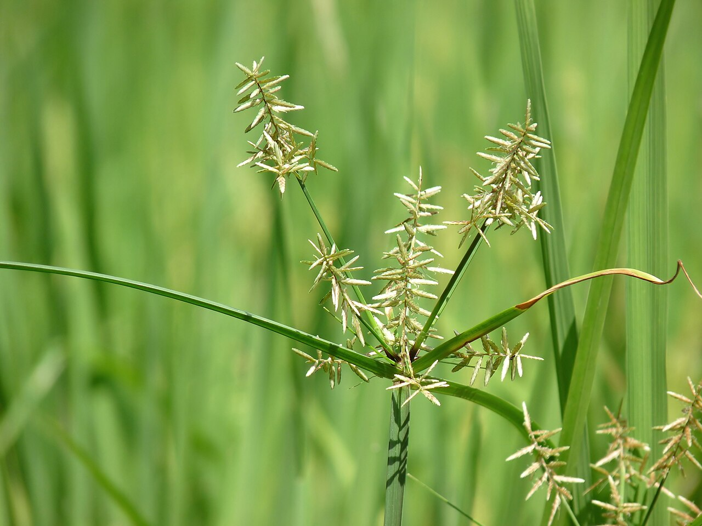
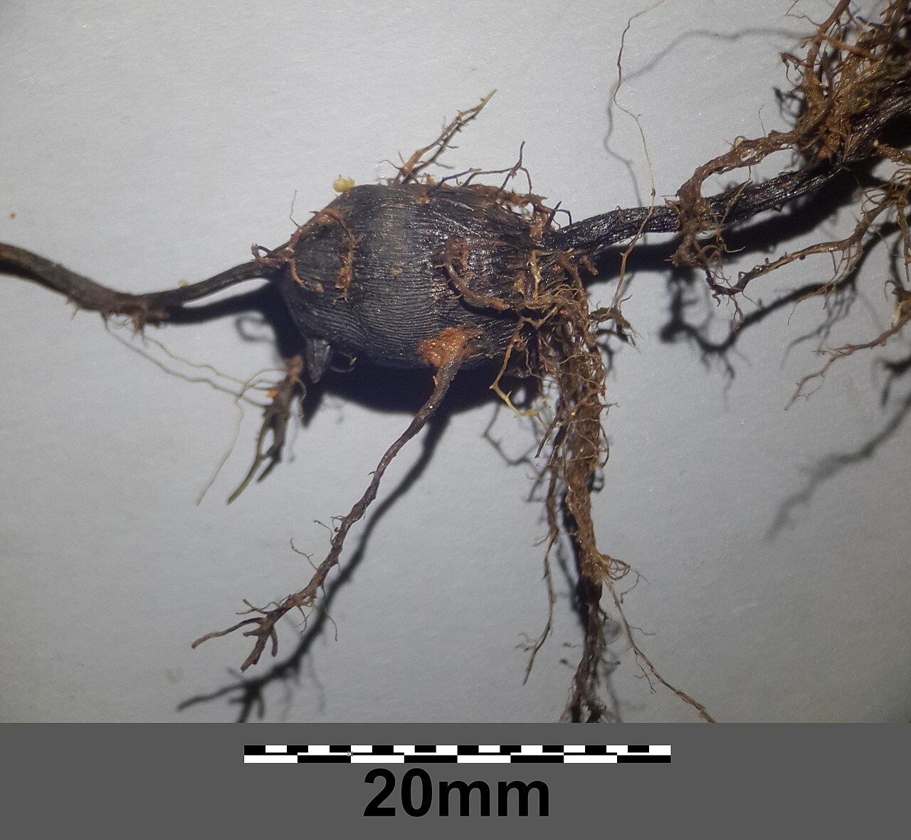
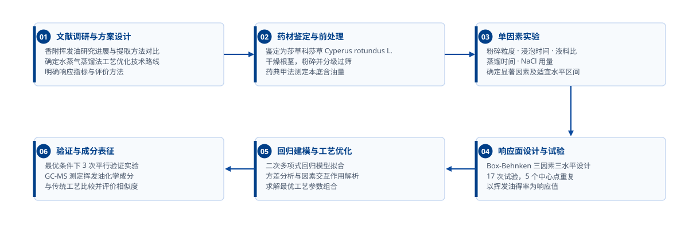
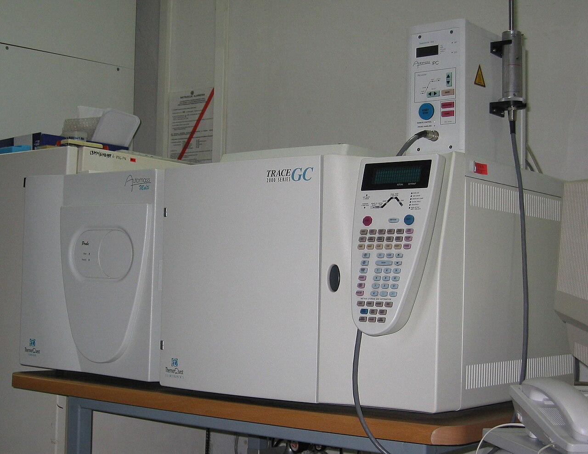
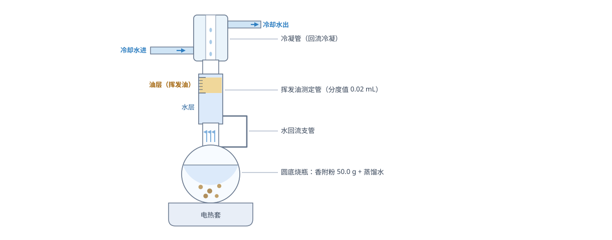
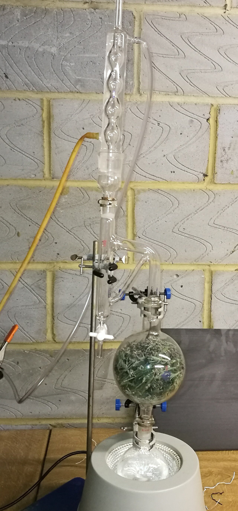
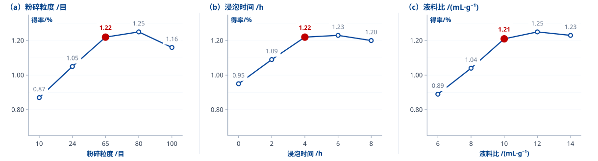
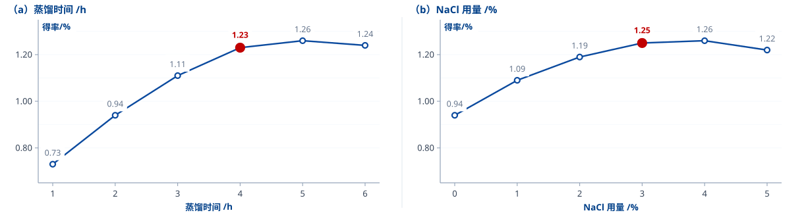
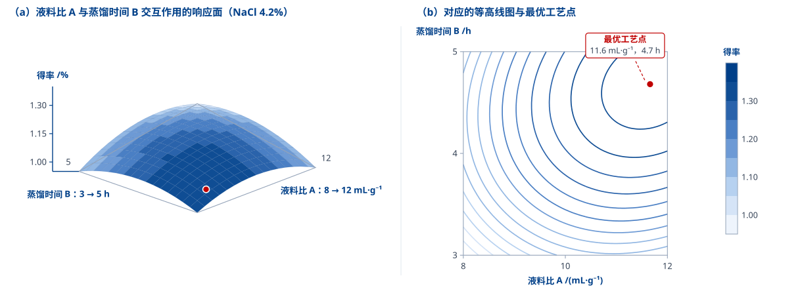
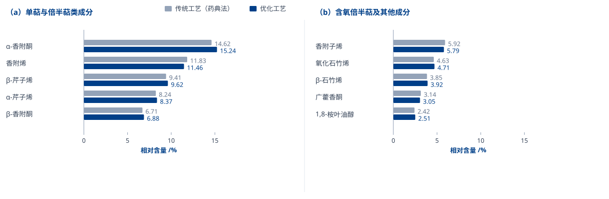

<!--
_paginate: false
_class: homePageCUST
-->

# 水蒸气蒸馏法提取香附挥发油的工艺优化

## 长沙理工大学 药学院 · 硕士学位论文答辩

<flex center>

<iconitem icon="话筒">答辩人：×××</iconitem>

<iconitem icon="人员">指导教师：××× 教授</iconitem>

<iconitem icon="日历">2026 年 9 月</iconitem>

</flex>

---

<!--
_paginate: false
_class: contents
-->

## 目录

- **01** 研究背景与意义
- **02** 文献综述
- **03** 研究内容与技术路线
- **04** 材料与方法
- **05** 结果与分析
- **06** 结论与展望

---

<!--
_paginate: false
_class: chapterPage
-->

01

## 研究背景与意义

### 香附的药用价值 · 挥发油的主体地位 · 现行工艺的瓶颈

---

<!--
_header: 研究背景 — 香附药材概况
_paginate: true
_class: contentPage
-->

香附为莎草科植物莎草 *Cyperus rotundus* L. 的干燥根茎，始载于《名医别录》，是中医临床常用的理气药，素有「气病之总司，女科之主帅」之称。

<datatable>

### 香附药材基本情况

| 项目 | 内容 |
|------|------|
| 基原 | 莎草科植物莎草 *Cyperus rotundus* L. 的干燥根茎 |
| 性味归经 | 辛、微苦、微甘，平；归肝、脾、三焦经 |
| 主要功效 | 疏肝解郁、理气宽中、调经止痛 |
| 药典标准 | 《中国药典》2020 年版一部；含挥发油不得少于 1.0%（mL·g⁻¹） |
| 主要活性部位 | 挥发油（倍半萜类为主），另含黄酮、生物碱、糖类等 |
| 现行提取方法 | 水蒸气蒸馏法（药典收载的法定方法） |

</datatable>

<tag>背景</tag> 香附药材资源丰富、临床用量大，其挥发油含量是《中国药典》的法定质控指标之一

---

<!--
_header: 研究背景 — 原植物与药用部位
_paginate: true
_class: contentPage
-->

<grid cols="2">

<figure compact>

**图 1** 香附原植物：莎草 *Cyperus rotundus* L. 的伞形花序
</figure>

<figure compact>

**图 2** 药用部位：地下根茎（块茎），表面黑褐色、具环节与纵皱纹（标尺 20 mm）
</figure>

</grid>

<note footnote>本页照片为同类植物的公开示意图，非本课题采样照片。来源：Jeevan Jose、Stefan.lefnaer / Wikimedia Commons（CC BY-SA 4.0）</note>

---

<!--
_header: 研究背景 — 挥发油是香附的主要药效部位
_paginate: true
_class: contentPage
-->

香附挥发油由倍半萜及其含氧衍生物、单萜类组成，是香附疏肝理气、镇痛抗炎等药理作用的主要物质基础。

<grid cols="2">

<card>

### 主要化学成分

- **α-香附酮**：含量最高的特征性成分
- **香附烯、α-芹子烯、β-芹子烯**：代表性倍半萜
- **β-香附酮、香附子烯**：含氧倍半萜类
- 另含 β-石竹烯、氧化石竹烯、1,8-桉叶油醇等

</card>

<card green>

### 主要药理活性

- 抗抑郁、抗焦虑，调节中枢单胺类递质
- 镇痛、抗炎，抑制前列腺素合成
- 雌激素样作用，用于调经止痛
- 促进胃肠动力，改善肝郁气滞证候

</card>

</grid>

<tag>关键认识</tag> 挥发油的得率与组成直接决定香附的临床疗效与制剂质量，提取工艺是药材资源化的第一道关口

---

<!--
_header: 研究背景 — 现行提取工艺的瓶颈
_paginate: true
_class: contentPage
-->

《中国药典》2020 年版以水蒸气蒸馏法作为香附挥发油的法定提取方法，但工艺参数长期沿用经验值，缺乏系统优化。

<grid cols="3">

<card red>

### 得率偏低

药典法实测得率仅约 1.0%，刚过法定下限，药材资源利用率不高。

<tag red>1.06%</tag>

</card>

<card yellow>

### 耗时较长

常规操作蒸馏 6 h，单批周期长，设备周转率低。

<tag yellow>6 h/批</tag>

</card>

<card red>

### 参数粗放

液料比、粒度、盐析剂等参数多凭经验，未考察交互作用。

<tag red>缺乏优化</tag>

</card>

</grid>

<tag>问题</tag> 现有工艺在得率、周期与参数合理性三方面均有改进空间，且尚无针对香附的多因素交互作用系统研究

---

<!--
_header: 研究背景 — 研究目的与意义
_paginate: true
_class: contentPage
-->

<grid cols="2">

<feature num="01">

### 提高得率

以挥发油得率为响应指标，系统优化水蒸气蒸馏工艺参数，提升药材资源利用率。

</feature>

<feature num="02" green>

### 解析交互作用

采用响应面法考察液料比、蒸馏时间、盐析剂用量之间的交互作用，给出可量化的参数区间。

</feature>

<feature num="03" yellow>

### 保证品质

以 GC-MS 对比优化前后挥发油的化学组成，确认工艺优化不改变药效物质基础。

</feature>

<feature num="04" gray>

### 服务生产

形成可复用、可放大的工艺参数组合，为香附挥发油的工业化提取提供实验依据。

</feature>

</grid>

<tag>研究意义</tag> 在《中国药典》法定方法框架内完成参数优化，既有理论价值，也具备直接的生产转化潜力

---

<!--
_paginate: false
_class: chapterPage
-->

02

## 文献综述

### 挥发油提取方法比较 · 香附挥发油研究现状 · 存在的问题

---

<!--
_header: 文献综述 — 挥发油提取方法比较
_paginate: true
_class: contentPage
-->

<datatable>

### 常用挥发油提取方法的比较

| 方法 | 原理 | 得率水平 | 优点 | 局限 |
|------|------|---------|------|------|
| 水蒸气蒸馏法 | 挥发性随水蒸气馏出 | 较低 | 设备简单、成本低、药典收载 | 耗时长、热敏成分易分解 |
| 超临界 CO₂ 萃取 | 超临界流体选择性溶解 | 高 | 低温、无溶剂残留 | 设备投资大、不适合极性成分 |
| 微波辅助提取 | 微波破壁强化传质 | 较高 | 速度快、能耗低 | 放大困难、局部过热 |
| 超声辅助提取 | 空化效应破坏细胞壁 | 较高 | 时间短、温度低 | 工业化设备不成熟 |
| 酶解辅助提取 | 酶解细胞壁促释放 | 较高 | 条件温和、专属性强 | 酶成本高、工艺难控制 |

</datatable>

<tag>方法选择</tag> 水蒸气蒸馏法虽得率不占优，但**设备通用、成本最低、药典收载**，仍是我国香附挥发油生产的主流方法，其工艺优化最具现实意义

---

<!--
_header: 文献综述 — 香附挥发油研究现状
_paginate: true
_class: contentPage
-->

<dlist label-width="5">

- 化学成分研究

  已从香附挥发油中分离鉴定出 100 余种化合物，以倍半萜类为主，α-香附酮、香附烯、α-芹子烯、β-芹子烯等为主要成分，其中 α-香附酮常作为质量评价的指标性成分。

- 药理作用研究

  挥发油在抗抑郁、抗炎镇痛、雌激素样作用及胃肠动力调节方面均有明确报道，作用机制多与调节单胺类递质、抑制炎症因子释放相关。

- 提取工艺研究

  现有报道多集中于超临界 CO₂、微波与超声等新型方法的横向比较，或对单一参数（如蒸馏时间）的简单考察，参数组合的**交互作用**研究较少。

</dlist>

<tag>研究空白</tag> 缺乏针对水蒸气蒸馏法本身的**多因素交互作用**系统研究；盐析剂（NaCl）用量与液料比、蒸馏时间的协同效应尚未见定量报道

---

<!--
_paginate: false
_class: chapterPage
-->

03

## 研究内容与技术路线

### 技术路线 · 研究内容 · 创新点

---

<!--
_header: 研究内容 — 技术路线
_paginate: true
_class: contentPage
-->

<figure>

**图 3** 本研究技术路线

</figure>

<note footnote>路线分六个阶段推进：文献调研 → 药材前处理 → 单因素实验 → 响应面试验 → 回归建模与优化 → 验证与成分表征。</note>

---

<!--
_header: 研究内容 — 研究内容与创新点
_paginate: true
_class: contentPage
-->

<grid cols="2">

<card>

### 主要研究内容

- 香附药材的基原鉴定与含油量本底测定
- 粉碎粒度、浸泡时间、液料比、蒸馏时间、NaCl 用量五个单因素考察
- Box-Behnken 三因素三水平响应面试验（17 次）
- 二次回归模型拟合、方差分析与交互作用解析
- 最优工艺验证及 GC-MS 成分对比

</card>

<card green>

### 创新点

- 首次系统考察 **NaCl 盐析用量** 与液料比、蒸馏时间的交互作用
- 建立预测精度高的二次回归模型（R² = 0.9950），给出定量参数区间
- 以 **GC-MS 相似度** 佐证工艺优化不改变药效物质基础

</card>

</grid>

<tag>核心问题</tag> 在保证挥发油化学组成不变的前提下，如何用最少的试验次数找到水蒸气蒸馏法的最优参数组合？

---

<!--
_paginate: false
_class: chapterPage
-->

04

## 材料与方法

### 药材与仪器 · 提取装置 · 实验设计 · 数据处理

---

<!--
_header: 材料与方法 — 药材、试剂与仪器
_paginate: true
_class: contentPage
-->

<grid cols="2">

<card>

### 药材与试剂

- 香附饮片：市售，经生药学教研室鉴定为莎草科莎草 *Cyperus rotundus* L. 的干燥根茎
- 氯化钠、无水硫酸钠：分析纯
- 蒸馏水：实验室自制

<tag>投料量</tag> 每次实验精密称取香附粉 **50.0 g**

</card>

<card>

### 主要仪器

- 挥发油测定器（《中国药典》2020 年版四部 通则 2204 甲法）
- 调温电热套（1000 mL 圆底烧瓶配套）
- 分析天平（分度值 0.1 mg）
- 气相色谱-质谱联用仪，HP-5MS 毛细管柱（30 m × 0.25 mm × 0.25 μm）

**图 4** 气相色谱-质谱联用仪（GC-MS）

</card>

</grid>

<note footnote>仪器照片为公开示意图，非本课题所用仪器的实拍照片。来源：Polimerek / Wikimedia Commons（CC BY-SA 4.0）</note>

---

<!--
_header: 材料与方法 — 水蒸气蒸馏装置与提取流程
_paginate: true
_class: contentPage
-->

<figure>

**图 5** 挥发油测定装置（《中国药典》2020 年版通则 2204 甲法）

</figure>

<note footnote>提取流程：称取香附粉 → 加蒸馏水浸泡 → 加入 NaCl 并混匀 → 电热套加热回流蒸馏 → 读取测定管中挥发油体积 → 计算得率。</note>

---

<!--
_header: 材料与方法 — 实验室装置实景
_paginate: true
_class: contentPage
-->

<flex>

<card>

**图 6** 水蒸气蒸馏装置实景

</card>

<card>

### 示意与实物的对应

- **下部**：电热套加热圆底烧瓶，瓶内为香附粉与蒸馏水
- **中部**：挥发油测定管，馏出的油水混合物在此分层，挥发油浮于上层
- **上部**：回流冷凝管，冷凝水经支管返回烧瓶，实现水相循环
- **读数**：停止加热、冷却至室温后读取油层体积

</card>

</flex>

<note footnote>本图为民用同类蒸馏装置的公开示意图，非本课题实验装置照片。来源：102% Yield / Wikimedia Commons（CC BY-SA 4.0）</note>

---

<!--
_header: 材料与方法 — 得率测定与计算
_paginate: true
_class: contentPage
-->

<grid cols="2">

<card>

### 测定方法

蒸馏结束后，停止加热，静置使油水两相充分分层，待测定管冷却至室温后读取挥发油体积（分度值 0.02 mL）。同批实验由同一人读数，以减少人为误差。

</card>

<card>

### 得率计算

挥发油得率按体积质量比计算，以百分数表示：

> 得率 /% = *V* / *m* × 100

式中 *V* 为挥发油体积（mL），*m* 为香附粉质量（g）。

</card>

</grid>

<tag>指标说明</tag> 该定义与《中国药典》「含挥发油不得少于 1.0%（mL·g⁻¹）」一致，便于与法定标准直接比较

---

<!--
_header: 材料与方法 — 单因素实验设计
_paginate: true
_class: contentPage
-->

<datatable>

### 单因素实验的因素与水平

| 考察因素 | 水平设置 |
|---------|---------|
| 粉碎粒度 | 10、24、65、80、100 目 |
| 浸泡时间 | 0、2、4、6、8 h |
| 液料比 | 6、8、10、12、14 mL·g⁻¹ |
| 蒸馏时间 | 1、2、3、4、5、6 h |
| NaCl 用量 | 0、1、2、3、4、5 %（w/v） |

</datatable>

<note>每次仅变动一个因素，其余因素固定在基准条件；实验重复 3 次，结果以「平均值 ± 标准差」表示。</note>

<tag>基准条件</tag> 过 65 目筛、浸泡 4 h、液料比 10 mL·g⁻¹、蒸馏 4 h、不加 NaCl

---

<!--
_header: 材料与方法 — 响应面实验设计
_paginate: true
_class: contentPage
-->

依据单因素实验结果，选取液料比（A）、蒸馏时间（B）、NaCl 用量（C）三个因素，采用 Box-Behnken 设计三因素三水平试验。

<datatable>

### 响应面试验因素与水平（编码值）

| 因素 | 编码 | −1 | 0 | +1 |
|------|:----:|:--:|:-:|:--:|
| 液料比 /(mL·g⁻¹) | A | 8 | 10 | 12 |
| 蒸馏时间 /h | B | 3 | 4 | 5 |
| NaCl 用量 /% | C | 1 | 3 | 5 |

</datatable>

<grid cols="3">

<metric>

#### 17

试验次数

<tag>含 5 个中心点</tag>

</metric>

<metric green>

#### 3

考察因素

<tag>A / B / C</tag>

</metric>

<metric yellow>

#### 1

响应指标

<tag>挥发油得率</tag>

</metric>

</grid>

---

<!--
_header: 材料与方法 — 数据处理与统计方法
_paginate: true
_class: contentPage
-->

<dlist label-width="5">

- 单因素数据处理

  每组实验重复 3 次，结果以平均值 ± 标准差表示，采用单因素方差分析（One-way ANOVA）比较组间差异，*P* < 0.05 判定为差异显著。

- 响应面建模

  以编码值为自变量，对 17 组试验数据进行二次多项式最小二乘拟合，模型形式为：
  Ŷ = β₀ + Σβᵢxᵢ + Σβᵢⱼxᵢxⱼ + Σβᵢᵢxᵢ²

- 模型检验

  以方差分析检验模型显著性（*P* < 0.05）与失拟项（*P* > 0.05），以决定系数 R²、校正决定系数 R²adj 与变异系数 CV 评价拟合优度。

- 成分分析

  采用 GC-MS 测定优化前后挥发油的化学成分，以夹角余弦法计算相似度。

</dlist>

---

<!--
_paginate: false
_class: chapterPage
-->

05

## 结果与分析

### 单因素实验 · 响应面优化 · 工艺验证 · 成分表征

---

<!--
_header: 结果与分析 — 单因素实验（一）
_paginate: true
_class: contentPage
-->

<figure compact>

**图 7** 粉碎粒度、浸泡时间与液料比对挥发油得率的影响（红点为选定水平）

</figure>

<tag>趋势</tag> 粒度过粗则传质阻力大、过细则易糊化结块；浸泡 4 h 后组织充分润胀；液料比增至 12 mL·g⁻¹ 时得率趋于平台

---

<!--
_header: 结果与分析 — 单因素实验（二）
_paginate: true
_class: contentPage
-->

<figure compact>

**图 8** 蒸馏时间与 NaCl 用量对挥发油得率的影响（红点为选定水平）

</figure>

<tag>趋势</tag> 蒸馏 4 h 后得率增长趋缓；NaCl 用量在 3%～5% 区间趋于饱和，表明盐析效应存在上限

---

<!--
_header: 结果与分析 — 单因素结果小结
_paginate: true
_class: contentPage
-->

<datatable>

### 单因素实验结论与响应面水平确定

| 因素 | 最高得率水平 | 选定水平 | 选择依据 |
|------|:-----------:|:-------:|---------|
| 粉碎粒度 | 80 目（1.25%） | 65 目 | 与 80 目差异不显著，过细易糊化、过滤困难 |
| 浸泡时间 | 6 h（1.23%） | 4 h | 4 h 后无显著提高，缩短工时 |
| 液料比 | 12 mL·g⁻¹（1.25%） | 10 mL·g⁻¹ | 10 与 12 差异小，中心水平取 10 |
| 蒸馏时间 | 5 h（1.26%） | 4 h | 4 h 后增长趋缓，兼顾能耗 |
| NaCl 用量 | 4%（1.26%） | 3% | 3%～5% 差异不显著，中心水平取 3 |

</datatable>

<tag>因素筛选</tag> 液料比、蒸馏时间、NaCl 用量三个因素影响幅度最大且相互关联，纳入响应面优化；粒度与浸泡时间固定为 65 目、4 h

---

<!--
_header: 结果与分析 — 响应面试验设计与结果
_paginate: true
_class: contentPage
-->

<datatable compact>

### Box-Behnken 试验设计与挥发油得率

| No. | A 液料比 | B 时间 | C NaCl | 得率/% | No. | A 液料比 | B 时间 | C NaCl | 得率/% |
|:---:|:-------:|:-----:|:------:|:------:|:---:|:-------:|:-----:|:------:|:------:|
| 1 | 8 | 3 | 3 | 0.96 | 10 | 10 | 5 | 1 | 1.13 |
| 2 | 12 | 3 | 3 | 1.08 | 11 | 10 | 3 | 5 | 1.09 |
| 3 | 8 | 5 | 3 | 1.07 | 12 | 10 | 5 | 5 | 1.26 |
| 4 | 12 | 5 | 3 | 1.31 | 13 | 10 | 4 | 3 | 1.26 |
| 5 | 8 | 4 | 1 | 0.98 | 14 | 10 | 4 | 3 | 1.25 |
| 6 | 12 | 4 | 1 | 1.18 | 15 | 10 | 4 | 3 | 1.26 |
| 7 | 8 | 4 | 5 | 1.09 | 16 | 10 | 4 | 3 | 1.24 |
| 8 | 12 | 4 | 5 | 1.29 | 17 | 10 | 4 | 3 | 1.27 |
| 9 | 10 | 3 | 1 | 1.01 |   |   |   |   |   |

</datatable>

<note footnote>得率范围为 0.96%～1.31%；13～17 号为中心点重复试验，用于估计纯误差。</note>

---

<!--
_header: 结果与分析 — 回归模型方差分析
_paginate: true
_class: contentPage
-->

<datatable compact>

### 二次回归模型的方差分析

| 来源 | 平方和 SS | 自由度 df | 均方 MS | F 值 | *P* 值 |
|------|:---------:|:--------:|:------:|:----:|:------:|
| 模型 | 0.2124 | 9 | 0.0236 | 156.29 | < 0.0001 |
| 残差 | 0.0011 | 7 | 0.0002 | — | — |
| 　失拟项 | 0.0004 | 3 | 0.0001 | 0.96 | 0.4912 |
| 　纯误差 | 0.0006 | 4 | 0.0002 | — | — |
| 总和 | 0.2134 | 16 | — | — | — |

</datatable>

<grid cols="4">

<metric>

#### 0.9950

R²

<tag>决定系数</tag>

</metric>

<metric>

#### 0.9887

R²adj

<tag>校正决定系数</tag>

</metric>

<metric green>

#### 1.06%

CV

<tag>变异系数</tag>

</metric>

<metric green>

#### 0.4912

失拟项 *P*

<tag>不显著</tag>

</metric>

</grid>

<note>模型极显著且失拟项不显著，R² 与 R²adj 均接近 1，说明该回归模型能够充分描述试验数据，可用于工艺参数的预测与优化。</note>

---

<!--
_header: 结果与分析 — 回归方程与因素显著性
_paginate: true
_class: contentPage
-->

> **二次多项式回归方程（编码变量）**：Ŷ = 1.2584 + 0.0943*A* + 0.0779*B* + 0.0534*C* + 0.0300*AB* + 0.0015*AC* + 0.0117*BC* − 0.0696*A*² − 0.0808*B*² − 0.0518*C*²

<datatable compact>

### 回归方程系数的显著性检验

| 项 | 系数 | 标准误 | *t* 值 | *P* 值 | 显著性 |
|----|:----:|:------:|:-----:|:------:|:------:|
| 常数项 | 1.2584 | 0.0055 | 228.99 | < 0.0001 | 极显著 |
| A 液料比 | 0.0943 | 0.0043 | 21.69 | < 0.0001 | 极显著 |
| B 蒸馏时间 | 0.0779 | 0.0043 | 17.93 | < 0.0001 | 极显著 |
| C NaCl 用量 | 0.0534 | 0.0043 | 12.29 | < 0.0001 | 极显著 |
| AB | 0.0300 | 0.0061 | 4.88 | 0.0018 | 极显著 |
| A² | −0.0696 | 0.0060 | 11.62 | < 0.0001 | 极显著 |
| B² | −0.0808 | 0.0060 | 13.50 | < 0.0001 | 极显著 |
| C² | −0.0518 | 0.0060 | 8.65 | < 0.0001 | 极显著 |

</datatable>

<note>交互项 AC（*P* = 0.8141）与 BC（*P* = 0.0974）未达显著水平，即 NaCl 用量与液料比、蒸馏时间之间不存在显著交互效应。</note>

---

<!--
_header: 结果与分析 — 响应面与交互作用
_paginate: true
_class: contentPage
-->

<figure>

**图 9** 液料比与蒸馏时间交互作用的响应面三维图（a）与等高线图（b）

</figure>

<tag>交互作用</tag> 液料比 A 与蒸馏时间 B 的交互项**极显著**（*P* = 0.0018），等高线呈明显椭圆；三个因素的二次项均极显著且系数为负，说明各因素均存在最优值

---

<!--
_header: 结果与分析 — 最优工艺预测与验证
_paginate: true
_class: contentPage
-->

对回归模型求解极值，得到最优工艺参数组合，并进行 3 次平行验证实验。

<compare>

<before badge="模型预测">

### 最优参数组合

对回归方程求偏导并令其为零：

- 液料比 A = **11.66 mL·g⁻¹**
- 蒸馏时间 B = **4.68 h**
- NaCl 用量 C = **4.21%**
- 预测得率 **1.34%**

</before>

<arrow>验证实验</arrow>

<after badge="实测验证" green>

### 3 次平行验证结果

按上述条件平行测定 3 次：

- 实测得率 1.33%、1.35%、1.31%
- 平均值 **1.33%**，RSD **1.5%**
- 与预测值相对偏差 **0.75%**

</after>

</compare>

<tag>验证结论</tag> 实测值与模型预测值高度吻合（相对偏差 < 1%），证明所建回归模型可用于工艺参数的预测与优化

---

<!--
_header: 结果与分析 — 优化工艺与传统工艺对比
_paginate: true
_class: contentPage
-->

<datatable>

### 优化工艺与药典法工艺的参数与结果对比

| 指标 | 传统工艺（药典法） | 优化工艺 | 变化 |
|------|:-----------------:|:-------:|:----:|
| 粉碎粒度 /目 | 24 | 65 | — |
| 浸泡时间 /h | 0 | 4 | 增加前处理 |
| 液料比 /(mL·g⁻¹) | 8 | 11.7 | +46.3% |
| 蒸馏时间 /h | 6 | 4.7 | **−21.7%** |
| NaCl 用量 /% | 0 | 4.2 | 新增 |
| 挥发油得率 /% | 1.06 | 1.33 | **+25.5%** |

</datatable>

<tag>综合评价</tag> 得率提高 25.5%、蒸馏时间缩短 21.7%；液料比上升使单批水量增加，单位产品的能耗与溶剂成本需通过中试进一步核算

---

<!--
_header: 结果与分析 — GC-MS 成分表征
_paginate: true
_class: contentPage
-->

<figure compact>

**图 10** 优化工艺与传统工艺所得挥发油主要成分相对含量对比（n = 3）

</figure>

<note footnote>GC-MS 条件：HP-5MS 柱（30 m × 0.25 mm × 0.25 μm）；EI 源 70 eV；程序升温；分流比 20:1。成分经 NIST 库检索并结合保留指数确认。</note>

---

<!--
_header: 结果与分析 — 成分相似度评价
_paginate: true
_class: contentPage
-->

<grid cols="3">

<metric>

#### 38 → 41

检出成分数

<tag>优化前后</tag>

</metric>

<metric green>

#### 0.9987

夹角余弦相似度

<tag>高度相似</tag>

</metric>

<metric>

#### 71.5%

主要成分合计

<tag>优化工艺（相对含量）</tag>

</metric>

</grid>

<grid cols="2">

<card green>

### 组成未发生改变

优化前后挥发油的成分种类基本一致，10 种主要成分的相对含量变化均小于 1 个百分点，说明工艺参数的改变主要提高了**提取效率**，而非改变了提取的**物质基础**。

</card>

<card>

### α-香附酮略有升高

指标性成分 α-香附酮相对含量由 14.62% 升至 15.24%，可能与盐析作用改善其在馏出液中的分配行为有关，有利于后续质量标准的稳定。

</card>

</grid>

<tag>品质评价</tag> 相似度 0.9987 表明优化工艺在提高得率的同时保持了挥发油的化学组成，药效物质基础未受破坏

---

<!--
_paginate: false
_class: chapterPage
-->

06

## 结论与展望

### 主要结论 · 创新点 · 不足与展望

---

<!--
_header: 结论与展望 — 主要结论
_paginate: true
_class: contentPage
-->

<checklist done>

- ~~香附药材经鉴定符合《中国药典》2020 年版规定，本底含油量符合法定要求~~
- ~~单因素实验明确粉碎粒度 65 目、浸泡时间 4 h 为适宜前处理条件~~
- ~~确定液料比、蒸馏时间、NaCl 用量为显著因素，并给出各自的最优区间~~
- ~~建立二次回归模型（R² = 0.9950，CV = 1.06%），失拟项不显著~~
- ~~最优工艺经 3 次平行验证，实测得率 1.33%，与预测值相对偏差 0.75%~~
- ~~GC-MS 对比表明优化前后挥发油组成一致，相似度 0.9987~~

</checklist>

<tag>结论</tag> 优化工艺为：过 65 目筛、浸泡 4 h、液料比 11.7 mL·g⁻¹、NaCl 4.2%、蒸馏 4.7 h，得率较药典法提高 25.5%

---

<!--
_header: 结论与展望 — 创新点
_paginate: true
_class: contentPage
-->

<grid cols="2">

<feature num="01">

### 参数交互作用的定量解析

首次针对香附水蒸气蒸馏法系统考察 NaCl 用量与液料比、蒸馏时间的交互作用，明确了 **A×B 交互项极显著**（*P* = 0.0018）。

</feature>

<feature num="02" green>

### 高精度预测模型

建立的三元二次回归模型 R² = 0.9950、CV = 1.06%，失拟项不显著，可用于工艺参数的定量预测与放大设计。

</feature>

<feature num="03" yellow>

### 得率与品质双重验证

在得率提高 25.5% 的同时，以 GC-MS 夹角余弦相似度 0.9987 佐证挥发油化学组成未发生实质改变。

</feature>

<feature num="04" gray>

### 可复用的工艺方案

全部实验在药典法定方法框架内完成，参数易于复现，无需更换设备，具备直接的生产转化可行性。

</feature>

</grid>

---

<!--
_header: 结论与展望 — 不足与展望
_paginate: true
_class: contentPage
-->

<grid cols="2">

<card red>

### 本研究不足

- 仅以挥发油**体积得率**为指标，未对 α-香附酮等单一成分做定量含量测定
- 液料比上升导致单批水量增加，能耗与溶剂成本的核算缺少中试数据支撑
- 挥发油的稳定性、储存条件及热敏成分在蒸馏过程中的变化未作考察

</card>

<card green>

### 后续工作展望

- 建立 α-香附酮等指标成分的 HPLC 或 GC 定量方法，以「得率 + 含量」双指标优化工艺
- 开展 10 L～50 L 规模的中试放大，考察传热与传质条件变化对得率的影响
- 引入分子蒸馏、膜分离等精制手段，进一步提升挥发油的品质与稳定性

</card>

</grid>

<tag>总体评价</tag> 本研究在药典法定方法内完成了水蒸气蒸馏工艺的系统优化，为香附挥发油的提取得率提升与工业化应用提供了实验依据

---

<!--
_paginate: false
_class: thanksPage
-->

# 恳请各位老师批评指正

## 感谢答辩委员会的指导与帮助

长沙理工大学 药学院　2026 年 9 月
