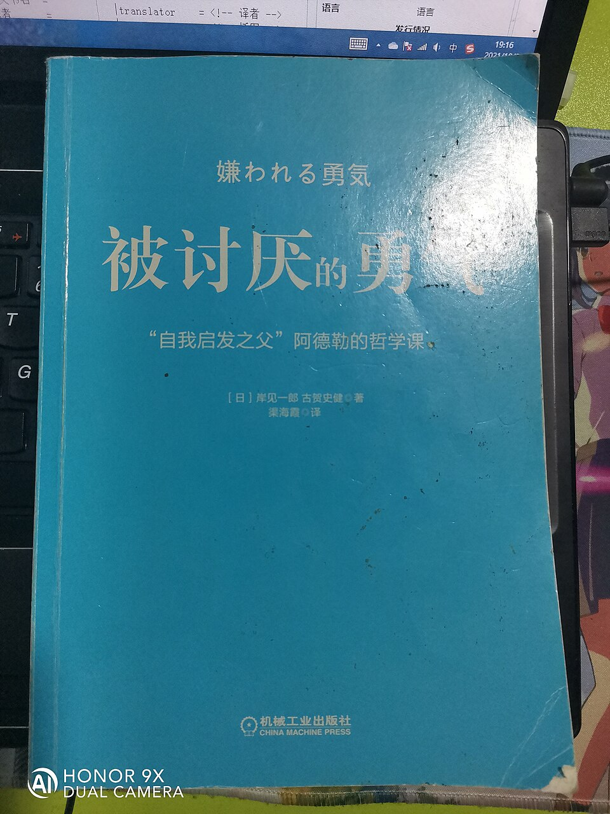
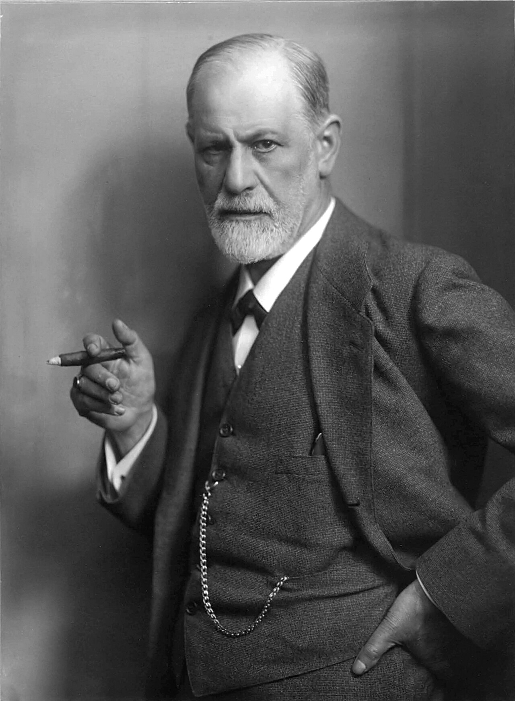
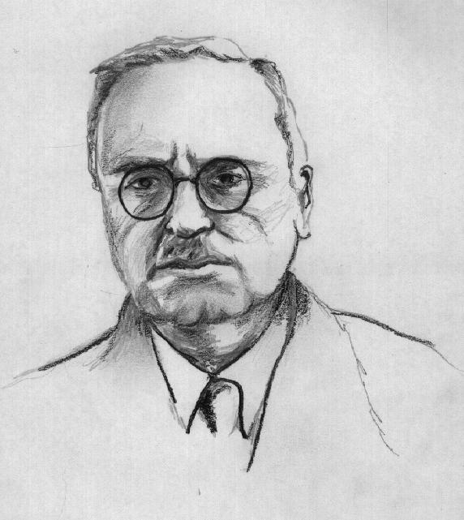
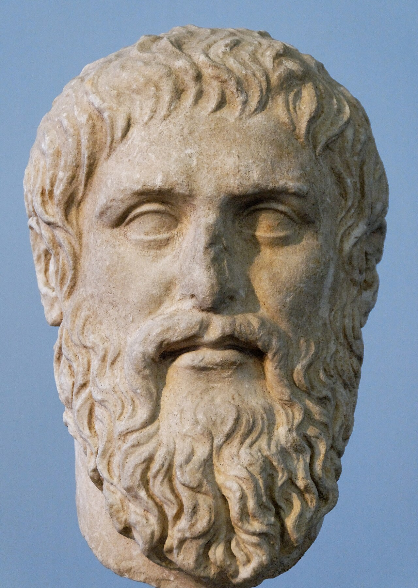
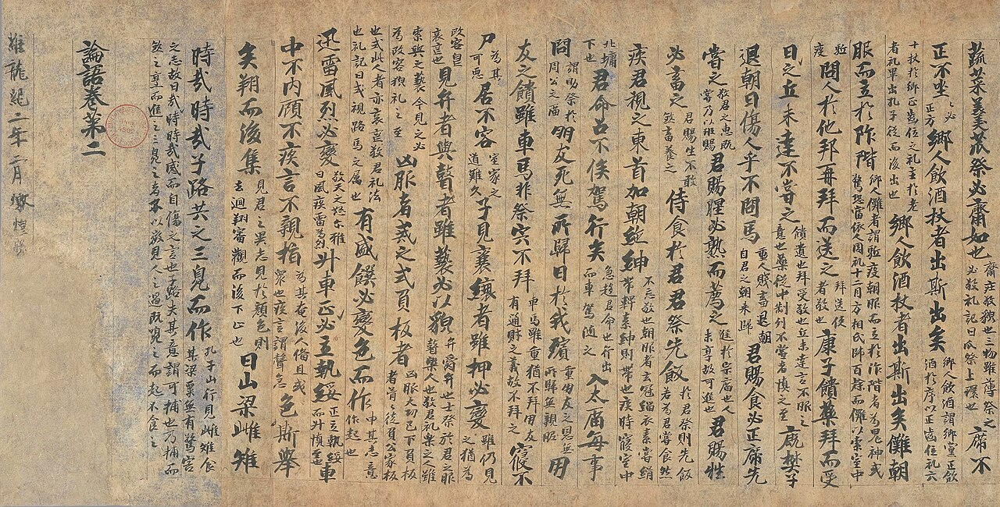
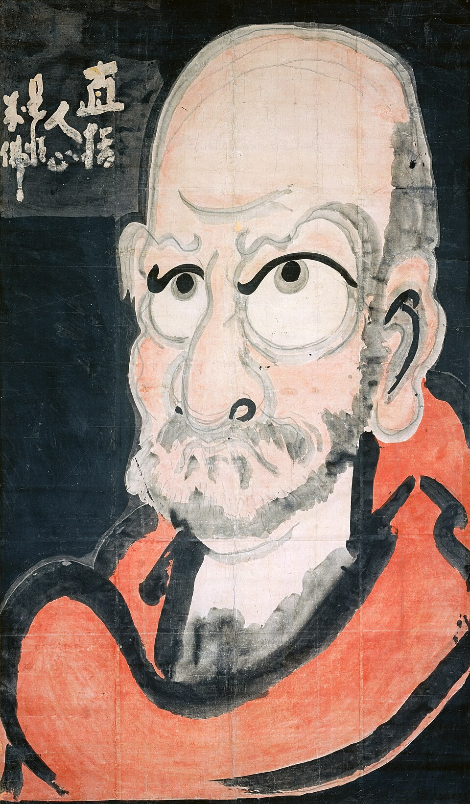

<!--
_paginate: false
_class: homePage
-->

# 被讨厌的勇气

## 一场关于「自由」的对话

汉语言文学 · 读书分享汇报　2026 年 9 月

---

<!--
_class: contents
-->

## 目录

- **01** 缘起：为什么是这本书
- **02** 骨架：五个夜晚的论证
- **03** 核心：阿德勒的几块基石
- **04** 文体：为什么用对话体写哲学
- **05** 争议：被误读的与被批评的
- **06** 回响：我的阅读与实践

---

<!--
_class: chapterPage
-->

01

## 缘起：为什么是这本书

### 一本畅销书，和一个文学研究生的疑问

---

<!--
_header: 缘起 — 我为什么拿起这本书
_class: contentPage
-->

## 我为什么拿起这本书

<flex>

<card>

### 契机一：一次推荐

朋友说「看完不内耗了」。我不太信——一本讲道理的书，真能改变一个人的状态？

</card>

<card>

### 契机二：一个现象

它 2013 年出版，至今长期霸榜，被摆进「心理自助」书架。**畅销，恰恰是它最可疑的地方。**

</card>

</flex>

<note footnote>这本书在中图法里被归入 **B821-49**（人生哲学·通俗读物），而不是 B84（心理学）——这个分类本身，就说明了它的暧昧位置。</note>

---

<!--
_header: 缘起 — 书籍名片
_class: contentPage
-->

## 书籍名片

<grid cols="2">

<datatable compact>

### 版本信息

| 项目 | 内容 |
|:-----|:-----|
| 日文原书名 | 『嫌われる勇気』（2013） |
| 作者 | 岸见一郎 · 古贺史健 |
| 思想来源 | 阿德勒 · 个体心理学 |
| 体裁 | 对话体 · 五个夜晚 |
| 中译本 | 渠海霞 译，机械工业出版社，2015 |

</datatable>

</grid>

它不是阿德勒的原著，而是**两位日本作者对阿德勒的一次重述**

---

<!--
_header: 缘起 — 我带着三个问题来读
_class: contentPage
-->

## 我带着三个问题来读

<grid cols="3">

<feature num="01">

### 它凭什么成立？

「目的论」是一个反直觉的论断——过去真的不决定现在吗？它的论证究竟落在哪里？

</feature>

<feature num="02" green>

### 为什么要这样写？

一本讲哲学的书，为什么放弃论文体，改用两个人你来我往的对话？

</feature>

<feature num="03" yellow>

### 它的边界在哪？

「只要有勇气就能改变」能解释所有处境吗？它解释不了的那部分是什么？

</feature>

</grid>

所以我给自己的任务不是「总结观点」，而是**检验论证**

---

<!--
_class: chapterPage
-->

02

## 骨架：五个夜晚的论证

### 从拆掉宿命，到交还边界，再到安放此刻

---

<!--
_header: 骨架 — 五个夜晚
_class: contentPage
-->

## 五个夜晚

<datatable>

| 夜 | 标题 | 核心问题 |
|:---|:-----|:---------|
| 第一夜 | 我们的不幸是谁的错？ | 目的论：心理创伤并不存在 |
| 第二夜 | 一切烦恼都来自人际关系 | 自卑感与竞争心态 |
| 第三夜 | 让干涉你生活的人见鬼去 | 课题分离 |
| 第四夜 | 要有被讨厌的勇气 | 共同体感觉 · 横向关系 |
| 第五夜 | 认真的人生「活在当下」 | 人生是连续的刹那 |

</datatable>

五夜其实是一条线：先**拆掉宿命**，再**交还边界**，最后**安放此刻**

---

<!--
_header: 骨架 — 论证的弧线
_class: contentPage
-->

## 论证的弧线

<flow now="2">

- 破：不幸不是被给予的
- 立：边界要自己划
- 合：此刻就是全部

</flow>

<grid cols="3">

<card red>

### 破 · 第一、二夜

把「不幸」从命运手里拿回来。不是过去决定了我，而是我为了某个目的，选择了现在这个样子。

</card>

<card>

### 立 · 第三、四夜

用「课题分离」划出边界，再用「被讨厌的勇气」守住它——不干涉别人，也不被别人干涉。

</card>

<card green>

### 合 · 第五夜

不再追赶想象中的终点线。人生不是一条通往某处的线，而是一连串此刻的舞动。

</card>

</grid>

---

<!--
_header: 骨架 — 两个声音
_class: contentPage
-->

## 两个声音

<flex>

<card>

### 哲人：阿德勒的代言人

从容、笃定，永远不直接给答案。他的武器是**反问**——把问题原封不动地推回给对方。

> 他不说服你，他只是让「你原来的想法」站不住。

</card>

<card red>

### 青年：读者的替身

固执、激动，一次次把书合上又打开。他说的每一句质疑，几乎都是我们心里的那声「可是……」

> 他那句「这不就是诡辩吗」，是全书的推进器。

</card>

</flex>

青年的每一次反驳都不是陪衬，而是**论证的换挡**

---

<!--
_class: chapterPage
-->

03

## 核心：阿德勒的几块基石

### 目的论 · 课题分离 · 共同体感觉

---

<!--
_header: 核心 — 阿德勒与他的老师
_class: contentPage
-->

## 阿德勒与他的老师

<grid cols="2">

<card>

### 弗洛伊德（1856–1939）

奥地利精神分析学派创始人。他把人的现在，追溯到童年与无意识——**过去解释现在**。

</card>

<card green>

### 阿德勒（1870–1937）

奥地利个体心理学创始人。早年追随弗洛伊德，1911 年分道扬镳，此后主张**人为了某个目的而行动**。

</card>

</grid>

本书讲的「目的论」，就是这条分手裂缝的**另一侧**

---

<!--
_header: 核心 — 目的论与原因论
_class: contentPage
-->

## 目的论 vs 原因论

<grid cols="2">

<card red>

### 原因论（弗洛伊德式）

现在的我，由过去的经历决定。

- 因为童年被否定，所以我自卑
- 因为受过伤害，所以我不敢亲近人

> 过去是**因**，现在是**果**。这条路走到底，只剩下「我没办法」。

</card>

<card green>

### 目的论（阿德勒式）

我是为了某个目的，才选择了现在的状态。

- 不是「因为不安所以不出门」
- 而是「为了不出门，制造出不安」

> 过去是**材料**，不是**判决**。路一下子回到了自己手上。

</card>

</grid>

<note footnote>注意：目的论并不否认经历的真实性，它否认的是「经历具有决定权」。阿德勒反对的不是创伤本身，而是把创伤当作不再行动的理由。</note>

---

<!--
_header: 核心 — 一切烦恼都是人际关系的烦恼
_class: contentPage
-->

## 一切烦恼都是人际关系的烦恼

<grid cols="3">

<metric>

### 孤独

孤独之所以成立，前提是**有他人存在**——一个人的宇宙里，不会有孤独。

</metric>

<metric red>

### 竞争

一旦把他人视为对手，他人的成功就变成我的失败。自卑与优越由此成对生长。

</metric>

<metric yellow>

### 认可欲求

把自己价值的裁判权交到别人手里，于是每一次被评价都成了一次心跳。

</metric>

</grid>

<tag>一句话</tag> 如果世上只剩你一个人，**自卑、嫉妒、孤独都会立刻消失**

---

<!--
_header: 核心 — 自卑感、自卑情结与优越情结
_class: contentPage
-->

## 自卑感 ≠ 自卑情结

<datatable>

### 三种容易混淆的状态

| 状态 | 本质 | 说法 |
|:-----|:-----|:-----|
| 自卑感 | 主观的「未完成感」，人人都有 | 我还可以更好 |
| 自卑情结 | 把自卑当作不行动的借口 | 因为我学历低，所以做不到 |
| 优越情结 | 靠夸耀与贬低他人掩盖自卑 | 要不是我，这项目早黄了 |

</datatable>

自卑感本身不是坏事，它是**一切成长的起点**；出问题的是用它来**停止行动**

---

<!--
_header: 核心 — 课题分离
_class: contentPage
-->

## 课题分离：这是谁的课题？

> **判断标准只有一条：这个选择带来的结果，最终由谁承担？**

<grid cols="3">

<card>

### 分离

谁承担结果，就是谁的课题。所有纠缠不清的关系里，总有一个人的课题被拿去替别人做了。

</card>

<card>

### 不干涉

「可以把马带到水边，但不能强迫它喝水。」提供帮助，不等于替对方做决定。

</card>

<card>

### 不被干涉

你如何评价我，是你的课题；我是否因此改变自己，是我的课题。两件事必须分开。

</card>

</grid>

课题分离不是疏远，而是**把不属于自己的责任还回去**

---

<!--
_header: 核心 — 课题分离的三个现场
_class: contentPage
-->

## 课题分离的三个现场

<grid cols="3">

<feature num="01">

### 亲子

父母的课题是提供条件与陪伴；学不学、学成什么样，是孩子的课题。替他学，等于取消他的人生。

</feature>

<feature num="02" green>

### 职场

我的课题是把方案想清楚、讲明白；同事是否采纳、领导是否认可，是他们的课题。

</feature>

<feature num="03" yellow>

### 友情

我的课题是表达真诚；对方是否回应、以什么方式回应，不是我能决定的事。

</feature>

</grid>

<note footnote>判断的难点不在「分清」，而在**分清之后仍然愿意关心**——课题分离去掉的是控制欲，不是关心。</note>

---

<!--
_header: 核心 — 被讨厌的勇气
_class: contentPage
-->

## 被讨厌的勇气

> **所谓的自由，就是被别人讨厌。**
>
> 不是去惹人讨厌，而是**不再害怕**被讨厌——不再为了换取一句好评，而修改自己的判断。

<flex>

<card red>

### 一个常见的误读

「被讨厌的勇气」不是「故意讨人厌」，也不是「不必顾虑他人感受」。它针对的只有一件事：**以被讨厌为代价，仍然守住自己的课题。**

</card>

<card green>

### 它换来的是什么

把评价权收回自己手里。你依然会听到反对的声音，但那声音不再自动等于「我错了」。

</card>

</flex>

<note footnote>引文依中文版大意整理。不同版次与译本的措辞略有出入，正式引用时建议核对原书页码。</note>

---

<!--
_header: 核心 — 共同体感觉
_class: contentPage
-->

## 从「我」到「我们」

<grid cols="3">

<metric>

### 自我接纳

接受「做不到的自己」，然后朝能做到的方向去努力——而不是骗自己「我很行」。

</metric>

<metric green>

### 他者信赖

无条件地把他人视为伙伴。信赖的决定权在我，不在对方是否值得。

</metric>

<metric yellow>

### 他者贡献

不是牺牲，而是体会到「我对共同体有用」。幸福感正落在这里。

</metric>

</grid>

<outline solid>

### 横向关系

阿德勒反对一切**评价**——表扬和批评一样，都是把人放在比自己低的位置上。人与人的关系应当是横向的：不同，但平等。

</outline>

---

<!--
_header: 核心 — 人生是连续的刹那
_class: contentPage
-->

## 人生是连续的刹那

<flex>

<card>

### 不是一条线

我们习惯把人生想成一条通往某个终点的线：考上就好了，升职就好了，退休就好了。于是**此刻永远只是手段**。

阿德勒说：人生是**一连串的刹那**，每一个刹那本身就是完成的状态。

</card>

<card green>

### 像跳舞一样

跳舞的目的不是跳到某个位置，跳舞本身就是目的。认真过好「此时此刻」，人生就不需要一条终点线。

> 你并不缺一个目标，你缺的是**允许自己在此刻停下来**

</card>

</flex>

<tag>金句</tag> 人生是连续的刹那，我们只能**活在此时此刻**

---

<!--
_class: chapterPage
-->

04

## 文体：为什么用对话体写哲学

### 形式不是容器，形式本身就是论证的一部分

---

<!--
_header: 文体 — 对话体的谱系
_class: contentPage
-->

## 对话体的谱系

<grid cols="2">

<timeline>

- 古希腊 · 柏拉图《对话录》

  > 哲学的第一次文体选择

  - 苏格拉底不写论文，只在街头提问
  - 结论在问答中浮现，而不是被宣布

- 中国 · 《论语》《孟子》

  > 问答体与语录体

  - 「子曰」的现场感，本身就是权威的来源
  - 孟子用层层设问，逼出论敌的自相矛盾

</timeline>

<timeline green>

- 东亚 · 禅宗公案

  > 以打断代替解释

  - 不给你答案，只给你一个更难的问题
  - 顿悟发生在语言失效的那一刻

- 日本近代 · 「对谈」传统

  > 知识人的日常文体

  - 杂志对谈、电视座谈，思辨被还原为说话
  - 岸见一郎与古贺史健，正接在这一脉上

</timeline>

</grid>

---

<!--
_header: 文体 — 对话体的两个源头
_class: contentPage
-->

## 对话体的两个源头

<grid cols="2">

<card>

### 柏拉图《对话录》

苏格拉底不写论文，只在街头提问。结论在问答中浮现，而不是被宣布——这是哲学的第一次文体选择。

</card>

<card yellow>

### 《论语》《孟子》

「子曰」的现场感，本身就是权威的来源。中国思想把老师的声音直接留在了文本里。

</card>

</grid>

<note footnote>相隔万里，两种思想都选择了「让人说话」而不是「让体系说话」——对话体不是入门读物，它本身就是一种立场。</note>

---

<!--
_header: 文体 — 禅宗的另一种对话
_class: contentPage
-->

## 禅宗的另一种对话

<grid cols="2">

<card gray>

### 公案

不给你答案，只给你一个更难的问题——顿悟发生在语言失效的那一刻。

</card>

<card>

### 同样是「你问我答」，目的相反

- 柏拉图与《论语》：用对话**传递**思想，问是为了抵达答案
- 禅宗公案：用对话**打断**思想，问是为了让答案失效

> 白隐慧鹤最著名的公案是「只手之声」：去听一只手拍出的声音。它没有答案，只有逼你离开概念的那一下。

</card>

</grid>

---

<!--
_header: 文体 — 对话体做了什么
_class: contentPage
-->

## 对话体做了什么

<grid cols="3">

<feature num="01">

### 降低门槛

哲学被翻译成日常语言。读者不必先学会术语，就能进入问题本身。

</feature>

<feature num="02" green>

### 制造张力

青年的反驳就是读者的反驳。每一次质疑被回应，读者也跟着被推进一步。

</feature>

<feature num="03" yellow>

### 留有余地

对话不封口，结论始终保持「可以继续问」的姿态。这既是它的魅力，也是它的破绽。

</feature>

</grid>

选择对话体，等于选择了**让读者参与论证**——但也等于放弃了论证的严密性

---

<!--
_header: 文体 — 把它当作「文本」来读
_class: contentPage
-->

## 把它当作「文本」来读

<grid cols="2">

<card>

### 人称里的权力关系

哲人始终称青年为「你」，青年却始终称他为「先生」。这个敬语标记，本身就是一段需要被拆解的关系——而课题分离恰恰要从这个「先生」开始松绑。

</card>

<card>

### 情绪是论证的换挡器

青年的「涨红了脸」「一时语塞」不是装饰。每一次情绪爆发，都对应着一个旧信念的崩塌。

</card>

<card green>

### 语体里的裂缝

「这不过是……罢了」「你听好了」——大量口语化的断言，读起来像格言而不是论证。这正是它容易被断章取义的原因。

</card>

<card green>

### 译本留下的痕迹

日文敬体与「先生」的译法，让中文版保留了一层礼貌的隔膜。读的时候不妨留意：哪些句子是阿德勒的，哪些其实是日本式的表达习惯。

</card>

</grid>

---

<!--
_class: chapterPage
-->

05

## 争议：被误读的与被批评的

### 一本书的边界，往往比它的观点更值得讨论

---

<!--
_header: 争议 — 三处值得警惕
_class: contentPage
-->

## 三处值得警惕

<grid cols="3">

<feature num="01" red>

### 把结构问题说成勇气问题

「你过得不好，是因为你选择了不改变」——这句话对身处贫困、疾病、歧视之中的人，近乎残忍。**并非所有处境都能靠调整心态改写。**

</feature>

<feature num="02" yellow>

### 课题分离的关系成本

在把关系看得比边界更重的东亚家庭里，「这是你的课题」常常被听成「我不管你了」。它需要的翻译成本，书中并未充分交代。

</feature>

<feature num="03" gray>

### 论证的松散

「一切烦恼都是人际关系的烦恼」是一个全称判断，全书却没有给出足以支撑它的证明——它被写出，而不是被论证出来。

</feature>

</grid>

---

<!--
_header: 争议 — 我的立场
_class: contentPage
-->

## 我的立场：接受什么，保留什么

<flex>

<card green>

### 我接受的

- **目的论的自省价值**：遇到挫败时先问「我图什么」，比追问「谁害了我」更有出路

- **课题分离的边界意识**：它给「过度负责」的人提供了一把尺子

- **不寻求认可的姿态**：把评价权收回自己手里，是一件可以练习的事

</card>

<card yellow>

### 我保留的

- **个体化的限度**：把一切归因于个人选择，会掩盖制度与结构的作用

- **关系伦理的落差**：阿德勒谈边界，儒家谈「成人」在关系中完成，二者并未真正对话

- **论证的严密性**：它可以启发人，但不能替代一套可检验的心理学理论

</card>

</flex>

---

<!--
_class: chapterPage
-->

06

## 回响：我的阅读与实践

### 一本书的价值，最终要落在它改变了什么

---

<!--
_header: 回响 — 这本书改变了我什么
_class: contentPage
-->

## 这本书改变了我什么

<grid cols="3">

<feature num="01">

### 把「为什么是我」换成「我想怎么样」

<tag>目的论</tag> 遇到挫败时先问目的，而不是先找原因。「原因」永远指向过去，「目的」却指向下一步——这个转念本身，就让情绪降了一档。

</feature>

<feature num="02" green>

### 停止揣测别人怎么看我

<tag green>课题分离</tag> 汇报之前不再反复模拟他人的反应。把力气从「他会不会觉得我讲得不好」收回到「我要讲清楚什么」，结果反而讲得更稳。

</feature>

<feature num="03" yellow>

### 允许有人不喜欢我

<tag yellow>被讨厌的勇气</tag> 不再为了维持「人人都满意」而过度解释。对一本书的观点也敢于说出「我不同意」——包括对这一本。

</feature>

</grid>

这三件事没有一件是「想通了」，全都是**练出来的**

---

<!--
_header: 回响 — 三条可以练习的事
_class: contentPage
-->

## 三条可以练习的事

<grid cols="3">

<card>

### 一 · 分清课题

遇到纠缠的事，先写下一句：**「这件事的结果由谁承担？」** 写下来，比想清楚容易。

</card>

<card green>

### 二 · 不评价他人

试着一天之内不表扬、也不批评任何人。你会发现「不评价」比「好好说话」难得多。

</card>

<card yellow>

### 三 · 停下来

在做一件事的时候，问自己：**如果这件事永远不会有结果，我还愿意做吗？** 愿意，就说明它此刻已经成立了。

</card>

</grid>

<tag>提醒</tag> 这三条都不是知识，而是**需要重复的练习**

---

<!--
_header: 回响 — 延伸阅读
_class: contentPage
-->

## 延伸阅读

<grid cols="2">

<card>

### 《自卑与超越》阿德勒

阿德勒本人的著作，目的论与自卑理论的原始出处。读完对话体，再回头读一手文本。

</card>

<card green>

### 《幸福的勇气》岸见一郎 · 古贺史健

续作，哲人与青年三年后重逢。这本回答的是本书留下的那个问题：**分离之后，如何相爱？**

</card>

<card yellow>

### 《论语》《孟子》

对话体在中国思想里的源头。对照读，会看见两种完全不同的「提问的目的」。

</card>

<card gray>

### 《理想国》柏拉图

对话体的西方起点。看苏格拉底如何用「只是提问」把对手一步步送到自己的结论上。

</card>

</grid>

<note footnote>图片来源（均取自 Wikimedia Commons）：书影 Te0sla / CC BY-SA 4.0；柏拉图胸像摄影 Marie-Lan Nguyen / CC BY-SA 2.5；弗洛伊德、阿德勒肖像、《论语》写本与白隐慧鹤《达磨图》为公有领域。</note>

---

<!--
_paginate: false
_class: thanksPage
-->

# 感谢聆听，欢迎交流

## 自由，从允许自己被讨厌开始
