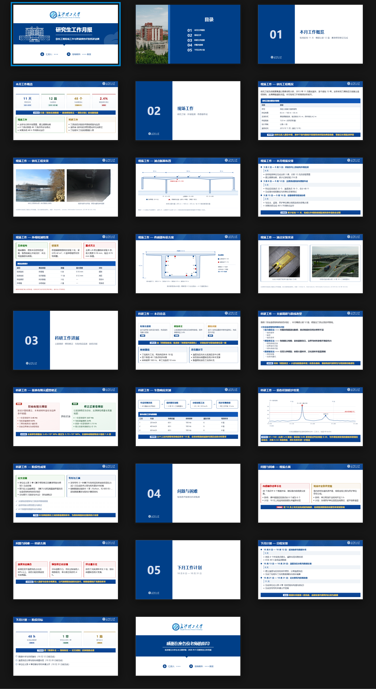
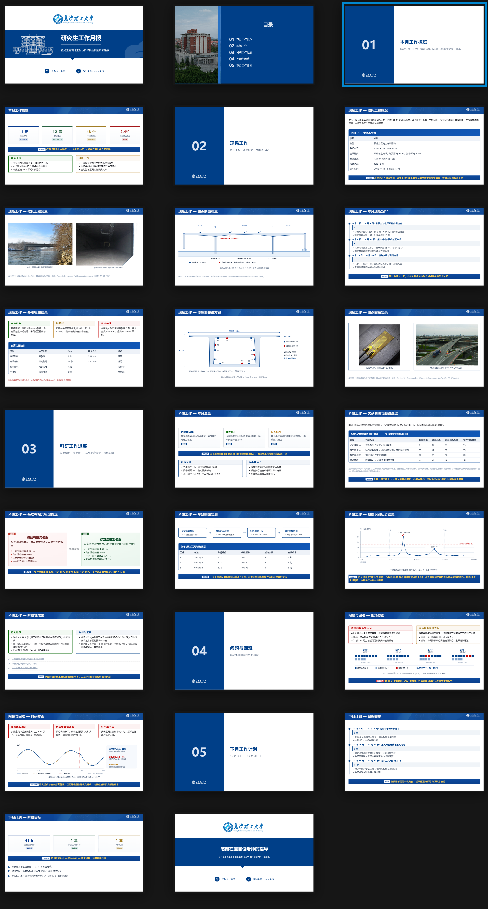

# AI 驱动的 Marp PPT 工作流

一个让 **AI 帮你做 PPT** 的项目：你用自然语言描述需求，AI 遵循本项目规范生成 Marp Markdown 源文件，再统一渲染成专业排版的演示文稿。

> 核心理念：**写，而非画**。一份 PPT 的本质是纯文本的 `.md` 源文件——可预览、可修改、可 diff、可版本管理。AI 产出的是「你能掌控的源码」，而不是一个改不动、不可控的二进制成品。

---

## 效果预览

两份真实文稿的连续页面，全部由 AI 生成 Markdown + Academic 主题渲染（点击图片查看原图）：

| 研究生工作月报 | 被讨厌的勇气 |
|---|---|
| <a href="assets/效果图.png"></a> | <a href="assets/效果图2.png"></a> |

> 左：`Examples/2026年9月研究生月报/`——月报 / 汇报场景，含封面、目录、5 个章节页与致谢页。
> 右：`Examples/被讨厌的勇气/`——读书分享场景，6 个章节的完整论述结构。

---

## 这个项目解决什么问题？

传统 AI 做 PPT 的两大痛点，正是本项目的出发点：

| 痛点 | 本项目的解法 |
|---|---|
| **不可控** | AI 不直接输出「成品 pptx」，而是按照 `ppt-generator skill` 的规范写出 Marp Markdown 源码。每页用了什么布局、什么组件，打开源码一目了然；不满意就让 AI 改，改哪里、怎么改都清清楚楚。 |
| **不好修改** | 内容与样式完全分离：内容写在 `.md` 里，样式由 Academic 主题统一控制。改文字就是改 Markdown，换风格只动主题、不动内容。纯文本天然支持 Git diff，每一次修改都可追溯。 |

一句话：**AI 负责把想法写成「看得懂、改得动」的 Markdown，而不是甩给你一个没法改的 pptx。**

## 核心能力：三层架构

| 层 | 内容 | 说明 |
|---|---|---|
| 第一层：Academic 主题基座 | `themes/academic/academic_template.css` | 统一的专业视觉风格：深蓝主色 `#003f88`、中文适配、封面/目录/章节/内容/致谢 5 种页面布局、页眉页脚页码、代码块双主题 |
| 第二层：组件库 | `themes/academic/academic_template.css`（与基座同文件） | 15+ 个语义化 HTML 组件：`card` `grid` `flex` `imginfo` `timeline` `tree` `metric` `compare` `outline` `tag` `summary` `mark` `note` `checklist` `dlist` `flow` `datatable` `iconitem` 等，**全部样式定义在 CSS 中**，像搭积木一样组合出丰富的布局。各组件的用法与效果演示见 `themes/academic/academic组件体系.md`（该文件只是展示 PPT，组件本身由 CSS 提供） |
| 第三层：AI 工作流 | `.claude/skills/ppt-generator/SKILL.md` | 把 AI 接入写作流程：描述需求 → AI 按规范生成 Markdown → Marp 渲染 → 多格式输出。AI 自动使用组件和主题，产出即符合规范。要动组件本身（新增组件、加变体、改样式）时走 `.claude/skills/ppt-component-design/SKILL.md`——那份写的是组件层的设计准则：组件只做语义与皮肤、布局归作者、变体只改变量、一个容器一种视觉手法 |

配套能力：

- **皮肤（换肤不改内容）**：`academic_CUST.css`（长沙理工大学）、`academic_NUDT.css`（国防科技大学）主要覆盖 CSS 变量——logo、封面 / 目录 / 致谢页背景图，页面结构仍由基座负责。品牌资源放 `themes/academic/定制皮肤/<品牌>/`，新增皮肤照抄一份改几个变量即可。长沙理工大学皮肤还额外带了两版线条页 `homePageCUST`（封面，标题左对齐）、`thanksPageCUST`（结尾页，整体居中），是皮肤专属的页面类，另一个皮肤里没有。圆底图标条目 `iconitem`（`<iconitem icon="话筒">汇报人：XXX</iconitem>`）是基座的原子组件，任何皮肤、任何页面都能用，图标素材（18 个白色线条图形）也是基座自带的，往 `themes/academic/images/icon/` 丢一个新 svg 就能用
- **多格式输出**：HTML（在线浏览）/ PPTX（可继续编辑）/ PDF
- **Git 原生版本管理**：Markdown 源码可 diff、可合并、可回滚
- **排版自检**：`scripts/check-slides.mjs` 逐页量版面溢出、插图渲染尺寸与 SVG 图内文字压字压线

## 项目结构

```text
.
├── .claude/skills/ppt-generator/SKILL.md   # AI 生成 PPT 的规范（核心！）
├── .claude/skills/ppt-component-design/    # 改主题组件时的设计准则
├── themes/academic/                        # Academic 主题
│   ├── academic_template.css               # 主题基座：全部样式与组件库都定义在这里
│   ├── academic_CUST.css                   # 长沙理工大学皮肤（只覆盖变量）
│   ├── academic_NUDT.css                   # 国防科技大学皮肤
│   ├── academic组件体系.md                 # 组件展示 PPT（仅演示效果，组件本身在基座里）
│   ├── academic颜色体系.md                 # 配色体系文档
│   ├── 定制皮肤/                           # 各皮肤用到的 logo / 背景图
│   └── images/                             # 主题用到的图片素材
├── Examples/                               # 示例文稿，每份独占一个目录（<文稿名>.md + media/）
│   ├── AI驱动的PPT生成方案/
│   ├── Git从入门到精通/
│   ├── 2026年9月研究生月报/
│   ├── 水蒸气蒸馏法提取香附挥发油的工艺优化/
│   └── 被讨厌的勇气/
├── scripts/check-slides.mjs                # 排版自检脚本
├── PPT/                                    # 你自己的文稿（独立 git 仓库，被根仓库忽略）
├── assets/                                 # README 用到的图片素材
├── .vscode/settings.json                   # 已配置 Marp 插件自动加载主题
├── package.json                            # 已内置 marp-cli、playwright 与常用命令
├── CLAUDE.md                               # 项目记忆（给 AI 的排版约定）
└── .gitignore                              # 已忽略 PPT/ 与导出产物
```

---

## 快速开始

### 0. 环境要求

| 依赖 | 用途 | 必需？ |
|---|---|---|
| [Node.js](https://nodejs.org/) ≥ 18 | 运行 marp-cli | ✅ 必需 |
| [VS Code](https://code.visualstudio.com/) | 编辑与实时预览 | 推荐 |
| Chrome / Chromium | PPTX 渲染 | 导出 PPTX 时需要 |
| [LibreOffice Impress](https://www.libreoffice.org/) | 生成**可编辑** PPTX | 仅 `--pptx-editable` 时需要 |
| Playwright 的 Chromium | 排版自检 | 仅 `npm run check:*` 时需要 |

### 1. 安装 Marp for VS Code 插件（可选，用于本地预览）

1. 安装 [Visual Studio Code](https://code.visualstudio.com/)
2. 在扩展市场搜索并安装 **Marp for VS Code**（`marp-team.marp-vscode`，[市场地址](https://marketplace.visualstudio.com/items?itemName=marp-team.marp-vscode)）
3. 打开任意 `.md` 文件，点击编辑器右上角工具栏的 Marp 图标，选择 `Toggle Marp feature for current Markdown`
4. 打开 Markdown 预览，即可实时看到幻灯片效果；保存自动刷新

> 本仓库的 `.vscode/settings.json` 已注册 `academic_template.css` / `academic_CUST.css` / `academic_NUDT.css` 三个主题并开启 HTML 渲染，克隆后开箱即用。

### 2. 安装 Marp CLI

本仓库已在 `package.json` 中内置 `@marp-team/marp-cli`，克隆后执行：

```bash
npm install
npx marp --version   # 验证安装
```

排版自检依赖的 Chromium 需要单独下载一次（装在全局缓存，Windows 下为 `%LOCALAPPDATA%\ms-playwright`，解压后约占 700MB，多个项目共用，只下这一次）：

```bash
npx playwright install chromium
```

也可以全局安装 Marp（[Marp 官方安装文档](https://marp.app/docs/introduction/install)）：

```bash
# Node.js 全局安装（官方不推荐，但简单直接）
npm install -g @marp-team/marp-cli

# Windows 可用 Scoop
scoop install marp

# macOS 可用 Homebrew
brew install marp-cli
```

> 更多用法与参数见 [Marp 官网](https://marp.app/) 与 [marp-cli 仓库](https://github.com/marp-team/marp-cli)。

### 3. 预览与导出命令

**主题必须用 `--theme-set` 把所有文件列全，且皮肤放在基座之后**——`@import` 不解析文件路径，多主题靠 CSS 层叠覆盖（被覆盖的在前，覆盖的在后）。下面以国防科大皮肤为例，实际换成文稿用的那个皮肤：

```bash
# 实时预览（浏览器打开，改动热更新）
npx marp <你的PPT.md> --theme-set themes/academic/academic_template.css themes/academic/academic_NUDT.css --html --preview --allow-local-files

# 导出 HTML
npx marp <你的PPT.md> --theme-set themes/academic/academic_template.css themes/academic/academic_NUDT.css --html --allow-local-files -o <输出.html>

# 导出 PPTX（图片式，还原度高）
npx marp <你的PPT.md> --theme-set themes/academic/academic_template.css themes/academic/academic_NUDT.css --html -o <输出.pptx>

# 导出可编辑 PPTX（文字/图形可在 PowerPoint 中继续改，需要 LibreOffice）
npx marp <你的PPT.md> --theme-set themes/academic/academic_template.css themes/academic/academic_NUDT.css --html --pptx-editable -o <输出.pptx>
```

> ⚠️ **`--theme-set` 里必须包含文稿 frontmatter 声明的那个 `theme:` 名字。** Marp 找不到声明的主题时**不报错、不警告、退出码照样是 0**，而是静默回落到它自带的 `default` 主题——页面结构、间距、配色全是错的，命令行上却看不出任何异常。比如文稿写 `theme: academic_CUST` 却只注册了 `academic_NUDT.css`，导出的就是一份完全没有主题的幻灯片。
>
> 自查办法：在导出的 HTML 里搜一下主题主色 `003f88`，搜不到就说明主题根本没生效。

只想用基座默认样式（不套皮肤）时，`--theme-set` 里只列 `academic_template.css` 一个文件即可，同时文稿 frontmatter 要写 `theme: academic_template`。

`package.json` 里保留了一组示例命令（拿 `Examples/Git从入门到精通/` 举例，换文稿时照着替换路径即可）：

| 命令 | 作用 |
|---|---|
| `npm run dev` | 实时预览 |
| `npm run build:git` | 导出 HTML |
| `npm run check:git` | 排版自检 |
| `npm run build:all` | 导出 HTML + PPTX |

### 4. 生成可编辑的 PPTX（`--pptx-editable`）

常规 PPTX 是「渲染好的图片」，无法在 PowerPoint 里改文字。加上 `--pptx-editable` 后，导出的 PPTX 中文字、形状、图片都是**真实可编辑的元素**，可以继续用 PowerPoint / WPS / LibreOffice 修改：

```bash
npx marp Examples/Git从入门到精通/Git从入门到精通.md \
  --theme-set themes/academic/academic_template.css themes/academic/academic_NUDT.css \
  --html --pptx-editable --allow-local-files -o Examples/Git从入门到精通/Git从入门到精通.pptx
```

前提是机器上装好了 **Chrome（或 Chromium）** 和 **LibreOffice Impress**。

> 注意：`--pptx-editable` 是 Marp 的实验性特性，复杂样式可能降低还原度，且不支持演讲者备注。日常修改请在 `.md` 源码上进行（改完重新导出即可），不要把编辑 PPTX 当主流程。

---

## 用 AI 生成 PPT（核心用法）

本项目是 **AI 优先** 设计的——**安装好环境后，命令不需要你亲手跑，让 AI 自己跑**。你只需要描述需求，AI 负责写源码、跑预览、导出成品。

### 第 1 步：让 AI 加载 Skill

在 AI 会话中让 AI 读取本项目规范：

- **Claude Code**：会自动识别 `.claude/skills/ppt-generator/SKILL.md` 这个 Skill，直接说「帮我做一份 PPT」即可触发
- **其它 AI 工具（Cursor / Copilot 等）**：把 `.claude/skills/ppt-generator/SKILL.md` 的内容粘贴给 AI，或让 AI 阅读该文件

Skill 里包含全部约定：页面类型（封面/目录/章节/内容/致谢）、组件用法、指令必须写在 `<!-- -->` 注释中、图片路径空格要编码成 `%20`、不要滥用 `compact` 等——AI 照此规范产出的 Markdown，渲染出来就是符合主题的成品。

### 第 2 步：描述需求

```text
帮我写一份项目季度汇报 PPT，面向管理层，15 页左右，
主题是「xx 项目进展」，需要目录页和章节页，风格专业。
```

AI 会根据 Skill 规范生成结构化 Markdown（自动使用 `card` / `grid` / `metric` 等组件，自动组织逻辑结构）。

### 第 3 步：让 AI 预览、迭代、导出

**不需要你手动敲命令**——让 AI 在项目目录下自己执行：

```bash
# 预览
npx marp Examples/<文稿名>/<文稿名>.md --theme-set themes/academic/academic_template.css themes/academic/academic_NUDT.css --html --preview --allow-local-files

# 微调：直接让 AI 改 Markdown 源码，改完重新预览
# 导出成品
npx marp Examples/<文稿名>/<文稿名>.md --theme-set themes/academic/academic_template.css themes/academic/academic_NUDT.css --html --allow-local-files -o Examples/<文稿名>/<文稿名>.html
npx marp Examples/<文稿名>/<文稿名>.md --theme-set themes/academic/academic_template.css themes/academic/academic_NUDT.css --html -o Examples/<文稿名>/<文稿名>.pptx

# 需要可编辑 PPTX 时（需安装 LibreOffice）
npx marp Examples/<文稿名>/<文稿名>.md --theme-set themes/academic/academic_template.css themes/academic/academic_NUDT.css --html --pptx-editable -o Examples/<文稿名>/<文稿名>.pptx
```

> 上面以 `Examples/` 里的示例文稿为例；你自己的文稿放在 `PPT/<文稿名>/` 下，把路径开头换成 `PPT/` 即可，其余完全一样。

整个流程里你要做的只有：**提需求 → 看效果 → 说修改意见**。AI 改的是源码，改完重新导出，永远可控、可回退。

---

## 示例文稿与个人文稿

两个目录的**结构完全一样**，差别只在于「谁的」：`Examples/` 是跟着主题工程一起发布的示例，`PPT/` 是你自己写的成品。

### `Examples/` —— 本仓库自带的示例

**每份文稿独占一个目录，配图放在该目录下的 `media/`**：

```text
Examples/
└── <文稿名>/
    ├── <文稿名>.md      # 唯一的源文件
    └── media/           # 该文稿的插图（jpg / png / svg）
```

这些文稿是用来演示效果的，覆盖了几种典型使用场景：

| 示例文稿 | 演示的场景 |
|---|---|
| `AI驱动的PPT生成方案` | 项目介绍 |
| `Git从入门到精通` | 教学 / 教程长文（含 6 张 SVG 插图） |
| `2026年9月研究生月报` | 周报 / 月报 |
| `水蒸气蒸馏法提取香附挥发油的工艺优化` | 论文答辩 |
| `被讨厌的勇气` | 读书分享 |

### `PPT/` —— 你自己的文稿

**你的个人 PPT 放 `PPT/` 目录**，每份一个子目录，结构和上面一样。推荐在 `PPT/` 下单独建一个 git 仓库，让文稿历史和主题工程彻底分开：

```bash
# 首次：在 PPT/ 下初始化独立仓库
cd PPT
git init
git remote add origin <你的仓库地址>
git add . && git commit -m "init" && git push -u origin main

# 日常：AI 改完源码后，直接提交到 PPT 仓库即可追溯版本
```

原因与配套配置：

- 根仓库的 `.gitignore` **已忽略 `PPT/` 目录**，两个仓库互不干扰
- `PPT/` 目录里自带 `.gitignore`，已忽略导出的 `*.pptx / *.pdf / *.html`（生成物由 `.md` 重新导出即可，不入库避免撑大仓库）
- **好处**：主题 / Skill 升级不影响你的文稿内容；每份文稿的修改历史独立、可 diff；二进制产物不进任何仓库

### 通用约定

- 正文里用相对路径引用配图：``——路径带空格时编码成 `%20`
- 文稿之间互不干扰，配图按目录隔离，不会重名冲突
- 导出的 `*.html` / `*.pptx` / `*.pdf` 已被 `.gitignore` 忽略：生成物由 `.md` 重新导出即可，不入库避免撑大仓库

---

## 排版自检

`scripts/check-slides.mjs` 把 Marp 产出的 HTML 丢进 Chromium 实测一遍排版，回答「这页会不会溢出」这类靠读 CSS 判断不准的问题：

```bash
npm run check:git
```

它做三件事：

1. **版面溢出**——逐页量最深内容相对 720px 版面的余量，标出「溢出 / 临界 / ok」
2. **插图渲染尺寸**——每张图的 `natural` 尺寸与实际渲染尺寸，以及是否加载成功
3. **SVG 文字检查**——图内文字是否越界、互相压字、被连线或曲线穿过

用法：

```bash
node scripts/check-slides.mjs <deck.html> [svg 目录] [标题关键字 ...]
```

`[svg 目录]` 位置传该文稿的 `media/` 即可开启 SVG 检查；再往后可以传标题关键字，额外打印指定页的纵向预算（每个顶层元素各占多高），用来定位哪里吃掉了高度。

> 自检需要 `npx playwright install chromium` 下载过一次浏览器（见「快速开始」第 2 步）。

---

## 参考演示文稿（建议先看这两个）

| 演示文稿 | 文件 | 内容 |
|---|---|---|
| **项目介绍 PPT** | `Examples/AI驱动的PPT生成方案/AI驱动的PPT生成方案.md` | 讲清「为什么需要这个方案」：传统 PPT 的痛点、Marp 是什么、本项目三层能力、组件生态一览、AI 辅助工作流、快速上手 |
| **组件展示 PPT** | `themes/academic/academic组件体系.md` | 每个组件的现场演示：grid / flex / card / outline / metric / timeline / compare / tree / tag / summary 等的用法与效果（注意：组件本身定义在 `themes/academic/academic_template.css` 中，这份 PPT 只是展示效果） |

查看方式（任选其一）：

```bash
# 方式一：命令行预览（浏览器打开）
npx marp Examples/AI驱动的PPT生成方案/AI驱动的PPT生成方案.md --theme-set themes/academic/academic_template.css themes/academic/academic_NUDT.css --html --preview
npx marp themes/academic/academic组件体系.md --theme-set themes/academic/academic_template.css --html --preview

# 方式二：用 VS Code 直接打开这两个 .md 文件，Marp 插件实时预览
```

## 相关文档与链接

- `CLAUDE.md` — 项目记忆：AI 的排版验证方式与项目结构速览
- `themes/academic/academic组件体系.md` — 组件用法与效果演示
- `themes/academic/academic颜色体系.md` — 配色体系
- [Marp 官网](https://marp.app/) — 官方文档：安装、指令、主题、语法
- [Marp CLI](https://github.com/marp-team/marp-cli) — 命令行工具
- [Marp for VS Code](https://marketplace.visualstudio.com/items?itemName=marp-team.marp-vscode) — VS Code 插件

---

## 赞赏支持

这个项目如果帮到了你，欢迎请我喝杯咖啡 ☕

| 微信 | 支付宝 |
|---|---|
|  |  |

提 Issue、发 PR、点个 Star 同样是支持，感谢。
